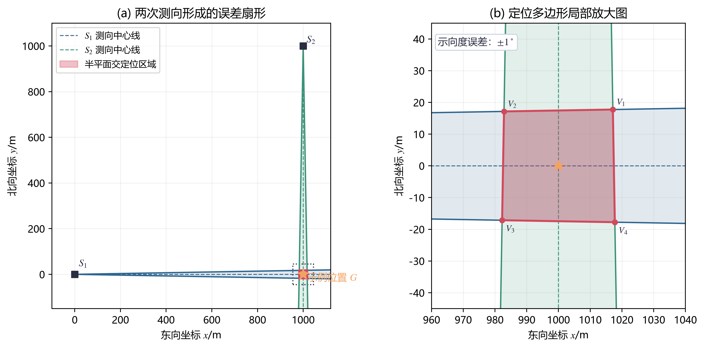
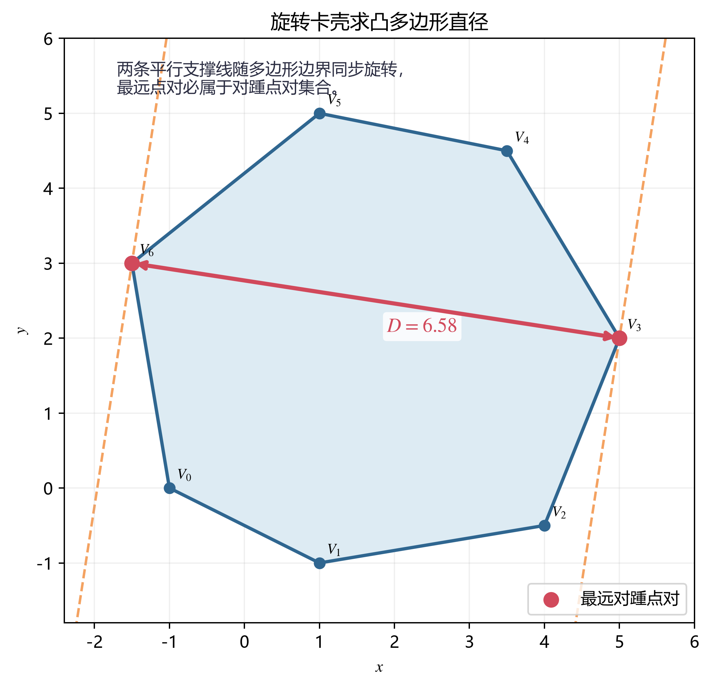
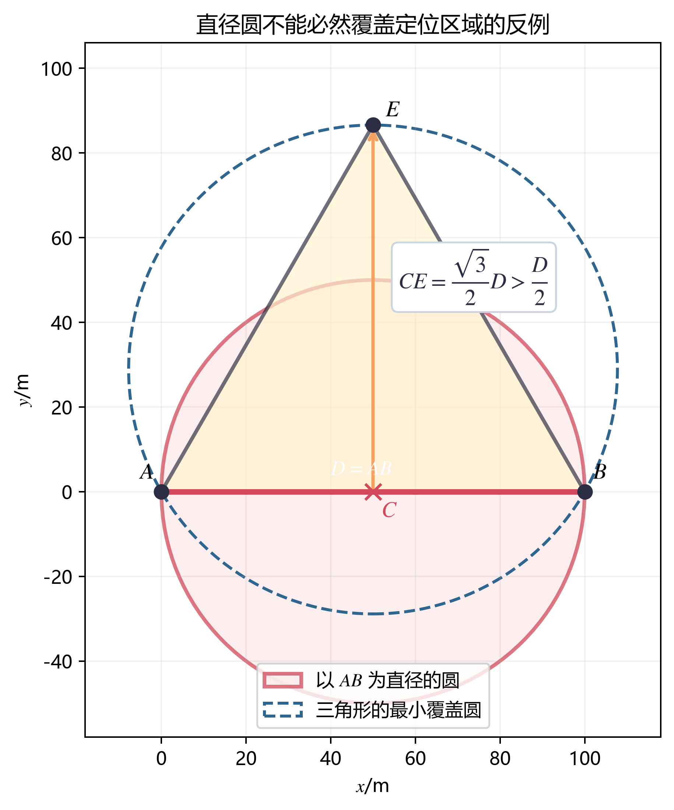
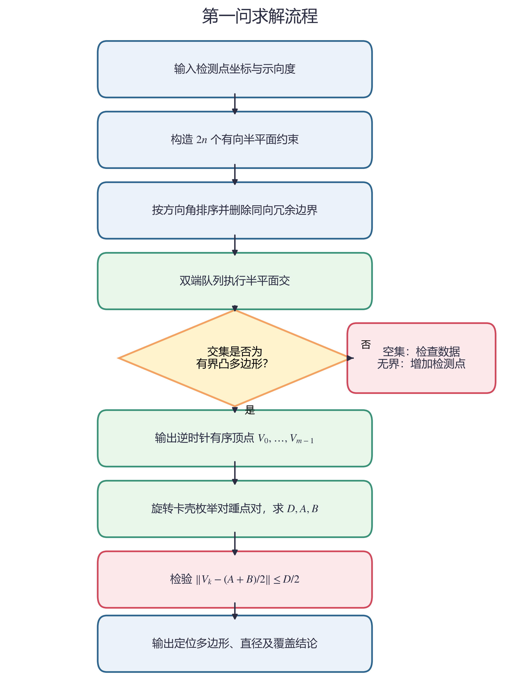

# B 题第一问成果汇总（队友版）

## 1. 一句话结论

将每次带有 \(\pm1^\circ\) 误差的示向度表示成一个角形区域，所有角形区域的交集就是干扰源的凸多边形定位区域；先用半平面交求出该多边形，再用旋转卡壳求其直径，最后逐顶点检验以最远点对为直径的圆是否覆盖整个定位区域。

一般而言，**以定位区域直径为直径的圆不一定覆盖定位区域**，必须对具体定位多边形进行检验。当前程序给出的演示算例能够覆盖。

---

## 2. 题目要求与建模目标

已知同一个干扰源的若干次测向记录：

\[
\mathcal M=\{(S_i,\theta_i)\mid i=1,2,\ldots,n\},
\]

其中 \(S_i=(x_i,y_i)\) 为第 \(i\) 个检测点，\(\theta_i\) 为测得的示向度。坐标系中 \(x\) 轴正向为正东，\(y\) 轴正向为正北，方位角从正东方向逆时针增加。

题目给定示向度误差范围为

\[
\alpha=1^\circ.
\]

需要完成三个计算：

1. 求干扰源的多边形定位区域 \(P\)；
2. 求定位区域的直径 \(D\)；
3. 判断以直径端点为直径所作的圆能否覆盖 \(P\)。

这里将测向误差视为确定性的有界误差，不假设其服从某一种概率分布。由于同一地点重复检测不会改变当地的固定误差，因此重复测量不能缩小该地点对应的角形约束。

---

## 3. 示向度约束的半平面表示

设干扰源真实位置为

\[
G=(x,y).
\]

第 \(i\) 次测量给出的真实方位角范围为

\[
\theta_i-\alpha\leq \arg(G-S_i)\leq \theta_i+\alpha.
\]

定义角形的两条边界方向向量

\[
\boldsymbol u_i^-=
\begin{bmatrix}
\cos(\theta_i-\alpha)\\
\sin(\theta_i-\alpha)
\end{bmatrix},
\qquad
\boldsymbol u_i^+=
\begin{bmatrix}
\cos(\theta_i+\alpha)\\
\sin(\theta_i+\alpha)
\end{bmatrix}.
\]

二维向量叉积记为

\[
\boldsymbol a\times\boldsymbol b=a_xb_y-a_yb_x.
\]

则干扰源必须同时满足

\[
\boldsymbol u_i^-\times(G-S_i)\geq 0,
\tag{1}
\]

\[
\boldsymbol u_i^+\times(G-S_i)\leq 0.
\tag{2}
\]

式（1）和式（2）分别是一个闭半平面。所有测向约束的交集为

\[
P=\bigcap_{i=1}^{n}\left(H_i^-\cap H_i^+\right).
\tag{3}
\]

由于半平面的交仍为凸集，所以当交集非空且有界时，\(P\) 是一个凸多边形。



**算法处理：**将每条边界线定向，使其可行域都位于有向直线左侧；按方向角排序，删除同向平行线中较宽松的约束，再用双端队列依次删除不可能成为最终边界的直线。该步骤即半平面交算法。

若共有 \(n\) 次测向，则有 \(2n\) 个半平面，排序是主要计算量，时间复杂度为

\[
O(n\log n).
\]

---

## 4. 用旋转卡壳计算定位区域直径

设半平面交得到按逆时针排列的凸多边形顶点

\[
P=\operatorname{conv}\{V_0,V_1,\ldots,V_{m-1}\}.
\]

定位区域直径定义为

\[
D=\max_{X,Y\in P}\|X-Y\|_2.
\tag{4}
\]

凸多边形上距离最远的两点一定可以在顶点中取得，因此

\[
D=\max_{0\leq i<j<m}\|V_i-V_j\|_2.
\tag{5}
\]

直接枚举所有顶点对需要 \(O(m^2)\) 时间。旋转卡壳利用凸多边形的对踵点性质，只需让指针沿多边形边界单调移动。

对边 \(V_iV_{i+1}\)，定义顶点 \(V_j\) 与该边构成的二倍三角形面积

\[
A(i,j)=\left|(V_{i+1}-V_i)\times(V_j-V_i)\right|.
\tag{6}
\]

只要

\[
A(i,j+1)>A(i,j),
\tag{7}
\]

就继续移动对踵点指针 \(j\)，并更新当前最大顶点距离。全部边只需被顺序扫描一次，因此旋转卡壳的时间复杂度为

\[
O(m).
\]



半平面交与旋转卡壳合并后的总时间复杂度为

\[
O(n\log n+m),
\]

通常可简写为 \(O(n\log n)\)。

---

## 5. 直径圆覆盖判定

设旋转卡壳求出的最远点对为 \(A,B\)，满足

\[
\|A-B\|_2=D.
\]

以 \(AB\) 为直径的圆盘圆心和半径分别为

\[
C=\frac{A+B}{2},
\qquad
R=\frac{D}{2}.
\tag{8}
\]

由于圆盘是凸集，只要定位多边形的所有顶点均在圆盘内，整个多边形就一定在圆盘内。因此覆盖的充要条件是

\[
\max_{0\leq k<m}\|V_k-C\|_2\leq R.
\tag{9}
\]

计算时也可使用等价的点积形式

\[
(V_k-A)\cdot(V_k-B)\leq 0,
\qquad k=0,1,\ldots,m-1.
\tag{10}
\]

若式（9）或式（10）对全部顶点成立，则直径圆覆盖定位区域；只要存在一个顶点不满足，便不能覆盖。

### 为什么不能直接回答“一定覆盖”

取边长为 1 的等边三角形作为定位区域。其直径为任意一条边，直径圆半径为 \(1/2\)，而第三个顶点到圆心的距离为 \(\sqrt{3}/2\)，显然有

\[
\frac{\sqrt 3}{2}>\frac12.
\]

所以第三个顶点位于圆外。这说明“直径是区域内最大距离”并不意味着“以该直径作圆就一定包住整个区域”。



---

## 6. 完整算法流程

```text
输入：检测点 S_i、示向度 theta_i、误差上界 alpha=1°

1. 对每次测量构造左右两条边界，共得到 2n 个半平面；
2. 对 2n 个半平面执行半平面交，得到逆时针凸多边形顶点 V_0,...,V_(m-1)；
3. 若交集为空、无界或退化，则报告当前测向信息不足或矛盾；
4. 对凸多边形执行旋转卡壳，求最远点对 A、B 及直径 D；
5. 令 C=(A+B)/2、R=D/2；
6. 逐个检验所有顶点是否满足 ||V_k-C||<=R；
7. 输出定位多边形、直径、直径端点、圆心、半径及覆盖结论。
```



---

## 7. 演示算例与计算结果

为了验证算法，当前代码使用下面的演示数据：

| 检测点 | 坐标/m | 示向度 |
|---|---:|---:|
| \(S_1\) | \((0,0)\) | \(0^\circ\) |
| \(S_2\) | \((1000,1000)\) | \(270^\circ\) |

两次测向误差上界均为 \(1^\circ\)。半平面交得到 4 个顶点：

| 顶点 | \(x\)/m | \(y\)/m |
|---|---:|---:|
| \(V_1\) | 1017.145162 | 17.754335 |
| \(V_2\) | 982.844387 | 17.155613 |
| \(V_3\) | 982.245665 | -17.145162 |
| \(V_4\) | 1017.765157 | -17.765157 |

计算结果如下：

| 指标 | 数值 |
|---|---:|
| 定位区域顶点数 | 4 |
| 直径 \(D\) | 49.385425824 m |
| 直径端点 \(A\) | \((982.844387,17.155613)\) m |
| 直径端点 \(B\) | \((1017.765157,-17.765157)\) m |
| 直径圆圆心 \(C\) | \((1000.304772,-0.304772)\) m |
| 直径圆半径 \(R\) | 24.692712912 m |
| 是否覆盖该定位区域 | 是 |

在此对称演示算例中，4 个顶点到圆心的距离均约为 \(24.692712912\) m，因此全部位于圆周上，直径圆能够覆盖定位多边形。

**注意：以上只是程序验证算例，不是题目给定的唯一数值答案。**第一问要求给出通用算法，实际结果由输入的检测点和示向度决定。

---

## 8. 程序验证情况

当前实现已通过 6 项测试：

1. 两次正交测向交会；
2. 正方形半平面交；
3. 等边三角形不被直径圆覆盖的反例；
4. 矩形直径计算；
5. 单次测向导致无界区域的异常处理；
6. 100 组随机凸多边形中，旋转卡壳结果与暴力枚举结果逐一一致。

测试结果为：

```text
Ran 6 tests
OK
```

---

## 9. 代码与文件说明

- `q1_localization.py`：半平面交、旋转卡壳和覆盖判定的完整代码；
- `example_input.json`：演示输入；
- `test_q1_localization.py`：单元测试与随机交叉验证；
- `generate_figures.py`：重新生成论文插图；
- `fig1_half_plane_intersection.*`：半平面交示意图；
- `fig2_rotating_calipers.*`：旋转卡壳示意图；
- `fig3_diameter_circle_counterexample.*`：不覆盖反例；
- `fig4_algorithm_flowchart.*`：算法流程图。

运行演示：

```powershell
python q1_localization.py --input example_input.json
```

运行测试：

```powershell
python -m unittest test_q1_localization.py -v
```

---

## 10. 队内讨论时需要统一的口径

1. 第一问的误差采用 \(\pm1^\circ\) 的确定性区间约束，而不是正态分布。
2. 半平面交得到的是凸多边形，旋转卡壳只负责求直径，不负责求最小覆盖圆。
3. “直径圆”与“最小覆盖圆”不是同一个概念。题目问的是前者能否覆盖，应按式（9）单独检验。
4. 若测向线近似平行，定位区域会很长；若约束不足，半平面交甚至可能无界，此时需要增加检测点。
5. 半径 1800 m 的目标圆域是干扰源的物理活动范围。若将它作为额外约束，真实可行域可能含圆弧而不再是纯多边形；当前第一问程序严格计算的是交会定位形成的多边形。必要时可另行扩展为“多边形与目标圆域的交”的直径计算。

