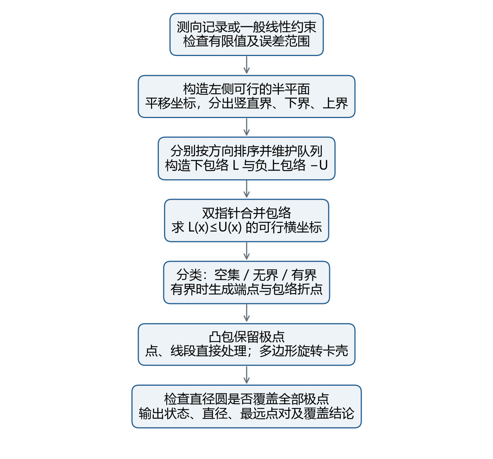
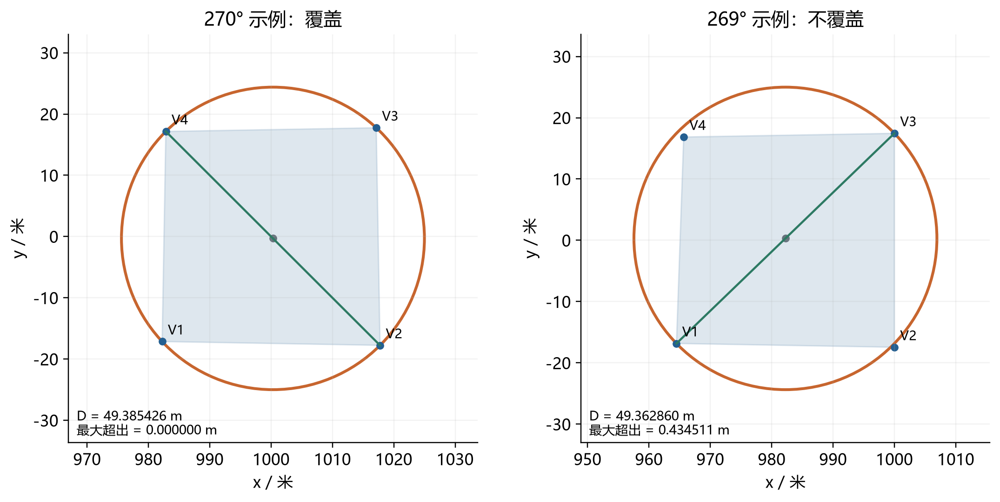
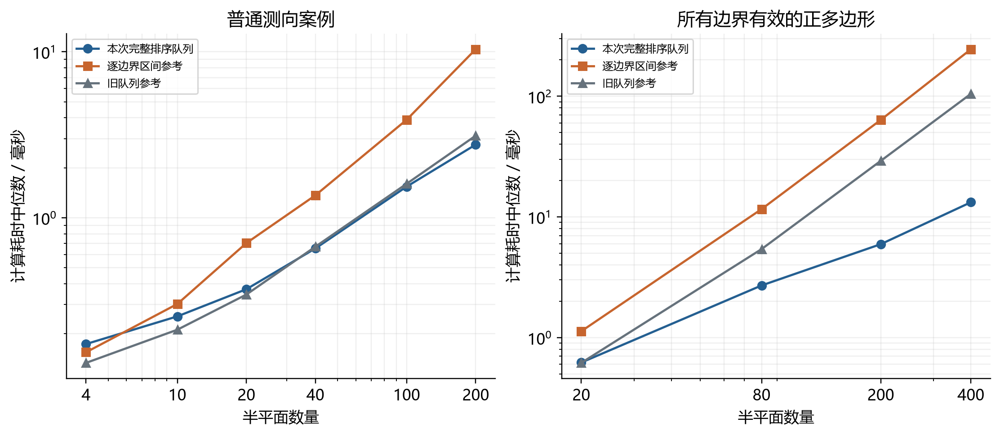

# 第一问排序队列算法与完整验证

本报告解决2026年全国大学生数学建模竞赛B题第一问：根据同一干扰源的若干次示向度计算角度交会区域直径，并判断是否存在直径等于区域直径的圆盘覆盖该区域。

结论：这样的圆盘不一定存在。计算上，采用按方向排序、分别维护上下边界队列的半平面交，再用旋转卡壳求直径。实现直接支持多边形、线段、单点、空集与无界区域，不使用人为大包围盒，也不调用逐边界区间法兜底。

$$
T(m)=O(m\log m),\qquad S(m)=O(m)
$$

当前版本为2026年9月12日排序队列完整版。52项单元与回归测试通过；另用独立线性规划核验1500组一般半平面，分类全部一致。这里的结果均为算法自建算例，不是官方模拟器成绩。

| 算例 | 类型 | 直径 / 米 | 直径圆覆盖 |
|---|---|---|---|
| 270°覆盖算例 | polygon | 49.385425824 | 是 |
| 269°反例 | polygon | 49.362859759 | 否 |
| 单点 | point | 0.000000000 | 是 |
| 线段 | segment | 3.491012986 | 是 |



## 题意范围与测向约束

坐标单位为米，正东方向为x正向，正北方向为y正向，角度从正东逆时针计量。每次记录为检测点S_i与示向度theta_i，误差半角alpha取1°。不同地点的误差仅被视为有界约束，不额外假设均匀或正态分布；同地点重复相同读数不增加信息。

$$
|\Delta_i(X)|\leq\alpha,\qquad\alpha=1^{\circ}
$$

周期角度差定义为 Delta_i(X)=((arg_deg(X-S_i)-theta_i+180°) mod 360°)-180°。通过方向向量构造约束可避免0°/360°跨界。设 u_i^-=(cos(theta_i-alpha),sin(theta_i-alpha))，u_i^+=(cos(theta_i+alpha),sin(theta_i+alpha))，则下边界叉积非负，上边界叉积非正。上边界反向后，全部可行半平面统一在有向直线左侧。

$$
H_j=\{X:d_j\times(X-p_j)\geq0\},\qquad P=\bigcap_{j=1}^{m}H_j
$$

本问的P专指题目附录2中由角形相交形成的定位区域。没有把1800米目标圆域或1500米接收上界裁入其中。加入圆盘后会出现圆弧，属于另一种可行域口径。角形采用闭包，包含检测点本身；这只是几何约定，不表示在源上能取得有效示向度。


每条约束也可写作 a*x+b*y>=c，其中(a,b)=(-d_y,d_x)，c=a*p_x+b*p_y。后续所有分组、排序与可行性计算都保持这些约束的交集不变；轴附近的浮点处理另见数值约定。

## 按方向排序构造上下包络

先把坐标平移到首条边界附近，以减小大坐标消减误差。对 a*x+b*y>=c，按照b的符号分组。b>0给出下界，b<0给出上界，b=0给出横坐标限制；竖直约束不需要做斜率除法。

| 约束组 | 转换结果 | 统一汇总 |
|---|---|---|
| b>0 | y>=(-a/b)x+c/b | 取全部下界的最大值 |
| b<0 | y<=(-a/b)x+c/b | 取全部上界的最小值 |
| b=0，a>0 | x>=c/a | 更新横坐标下界 |
| b=0，a<0 | x<=c/a | 更新横坐标上界 |

$$
L(x)=\max_i(l_i x+b_i),\qquad U(x)=\min_j(u_j x+c_j)
$$

L是所有下界直线的最大包络，U是所有上界直线的最小包络。把上界取负后，-U也变成最大包络，因此可以共用一套队列算法。在每一组内，斜率顺序与边界方向顺序单调对应，不需要把跨越0°的全圆角度直接拼接。

同斜率的最大包络函数只保留截距最大的一条；这等价于同向平行半平面保留最严格者。反向平行约束会落入上下两组，或落入左右竖直界，是否矛盾将在可行性阶段判断，不能一律当成空集。


## 队列如何删除冗余边界

对于最大包络，将函数f(x)=l*x+b按斜率从小到大排序。队列保存仍有作用的函数，以及它开始成为最大值的横坐标s。随着x从负无穷增大，最大包络的有效斜率只能增大，所以每条有效边界对应一个连续区间。

$$
s=\frac{b_{\rm old}-b_{\rm new}}{l_{\rm new}-l_{\rm old}}
$$

加入斜率更大的新函数时，计算它与队尾函数的交点s。若s不大于队尾原本的生效起点，说明旧队尾尚未来得及生效，就已被新函数压过，应弹出旧队尾并重算。直到新交点严格位于队尾的有效起点之后，再把新函数及交点入队。

```text
按斜率排序，同斜率保留更大截距
Q = 空队列；starts = 空队列
对每个新函数 f：
    当 Q 非空：
        s = f 与 Q尾部函数的交点横坐标
        若 s > starts尾部：退出循环
        弹出 Q尾部与 starts尾部
    若 Q 为空：s = -∞
    将 f 与 s 分别加入队尾
```

队列中各函数的生效起点严格递增。插入新函数后，队列仍表示所有已处理函数的最大包络；被弹出的函数不再改变包络值，即使在孤立点并列达到最大也无须保留。这给出归纳不变量。每个函数最多入队一次、出队一次，因此排序后的构造阶段为线性时间。


示意例按负上界斜率0、1、2，依次加入y<=5、x+y<=5、2x+y<=3。旧拐角(0,5)不满足新约束；中间边界x+y=5被弹出，最终上界为min(5,3-2x)，在(-1,5)切换。两条保留约束相加再除以2，已推出x+y<=4，因此删除x+y<=5不会扩大交集。本实现采用上下队列形式，区别于旧版单一闭合队列。

## 可行性判别与特殊情况

$$
I=[x_{\min},x_{\max}]\cap\{x:L(x)-U(x)\leq0\}
$$

两组包络的折点均已排序。用两个指针合并折点，在每一个公共区间中，L和-U各由一条直线表示，因此F=L-U是一次函数。直接解F(x)<=0，再与当前区间、竖直约束给出的范围相交。全部公共区间的数量至多是两组边界数量之和，不是两两枚举。

F是凸函数，故其非正子水平集为一个区间、单点或空集。程序先确认竖直界相容；若缺少上界或下界，可沿竖直方向无限延伸。两组都存在时，先求可行横坐标；空则返回empty，非空且横坐标无界则返回unbounded，横坐标有界时再生成有界区域。

| 特殊输入 | 实际结果 | 处理依据 |
|---|---|---|
| x>=1 与 x<=0 | 空集 | 竖直上下界矛盾 |
| y>=1 与 y<=0 | 空集 | L始终高于U |
| 0<=x<=1 | 无界条带 | 缺少竖直方向的上下封闭 |
| y=x | 无界直线 | 可行横坐标无界 |
| y=x，0<=x<=3 | 线段 | 上下包络重合且横坐标有界 |
| x>=0，y>=0，x+y<=0 | 单点 | 可行横坐标与高度均缩成一点 |


## 有界区域与直径的正确性

当可行横坐标为有限闭区间[a,b]时，区域由L(x)<=y<=U(x)精确描述。收集a、b处的上下端点，以及落在区间内的上下包络折点，再取凸包。全部区域顶点都包含在这些候选点中，而所有候选点都满足约束；凸性保证端点凸包恰好为整个区域。

$$
P=\operatorname{conv}\{V_1,\ldots,V_k\}
$$

如果a=b，可能只剩一条竖直线段或一个点；如果a<b但上下边界全程重合，则为非竖直线段。凸包去除重复与共线冗余点后，单点返回D=0，线段返回端点距离。所有边界都由实约束产生，没有人为包围盒端点。

$$
D(P)=\max_{1\leq i\leq j\leq k}\|V_i-V_j\|_2
$$

顶点直径定理：任意X与Y可分别写成顶点的凸组合。将X-Y展开为顶点差V_i-V_j的凸组合，应用三角不等式可得其长度不超过最大顶点对距离。反过来，顶点属于P，因此两者相等。

旋转卡壳沿逆时针凸包遍历每条边，让对踵指针在面积增大时单调前移。对于边V_i V_(i+1)，比较(V_i,V_j)和(V_(i+1),V_j)的距离；当两个相邻对踵点具有相同支撑面积时，还检查j+1对应的两组距离，避免遗漏平行支撑边。

```text
k=1：D=0；k=2：D=两端距离。
k>=3：依次推进边i与对踵点j，更新支撑点对的最大平方距离。
平行支撑时同时检查j+1，最后对最大平方距离开平方。
```

对踵指针单调绕行，旋转卡壳时间为O(k)。本次把面积比较改为随边长和步长缩放的相对容差，避免旧固定面积容差在微小多边形上提前停止。测试包含缩放到微米量级的多边形，并与全部顶点对枚举比较。


## 直径圆覆盖判定与题内反例

$$
C=\frac{A+B}{2},\qquad R=\frac{D}{2},\qquad \max_i\|V_i-C\|_2\leq R
$$

取最远点对A、B，圆心为中点，半径为D/2。只需检查全部极点：圆盘是凸集，若它包含全部极点，就包含极点凸包；若某极点在圆外，就不能覆盖。覆盖允许落在圆周上。

为什么只检查这个圆心就能回答“是否存在这样的圆”？任意半径D/2且同时包含A、B的圆盘都满足 |A-B|<=|A-C|+|C-B|<=D。两处都必须取等号，所以圆心只能是A、B中点。该圆不覆盖时，换圆心也无法以同样半径覆盖全部区域。



题内反例取S1=(0,0)、theta1=0°，S2=(1000,1000)、theta2=269°，半角均为1°。程序给出D=49.362859759米，R=24.681429880米，最远顶点到圆心距离为25.115941025米，超出0.434511145米，因此不覆盖。

两条读数中心线交于G=(1000-1000 tan1°,0)，约为(982.544935,0)。G位于1800米源域内，距两个检测点约982.545米和1000.152米；取允许范围内的接收半径1200米即可满足接收条件。因此该反例可以在本题物理设定内成立。

## 与最小包围圆及后续清除的关系

$$
D=40,\qquad R_{\min}=\frac{40}{\sqrt{3}}\approx23.094>20
$$


等边三角形给出直观解释：边长40米，区域直径为40米，但最小包围圆半径为40/sqrt(3)，约23.094米。用任一边的中点作为圆心、20米作半径，都无法覆盖第三个顶点。

因此D<=40米不能单独保证存在一次20米清除位置。后续问题如果要保证一次清除，应检查最小包围圆半径是否不超过20米，或者检查某个候选圆确实覆盖全部可行区域。本问默认求解器只回答直径与直径圆覆盖，不额外枚举最小包围圆，以免把更高复杂度的可选计算混入O(m log m)结论。

图片中的最小包围圆是等边三角形的解析结果；不是声称当前求解器默认实现了任意多边形的最小包围圆。完整通用最小包围圆应由后续定位清除模块负责。

## 复杂度与浮点数值约定

| 阶段 | 时间 | 说明 |
|---|---|---|
| 构造与分组 | O(m) | 所有法向单位化，竖直界单独处理 |
| 两组方向排序 | O(m log m) | 同方向保留最严格约束 |
| 两组队列构造 | O(m) | 每条边界最多入队、出队一次 |
| 包络折点合并 | O(m) | 两个指针线性前移 |
| 候选端点求凸包 | O(m log m) | 候选点数量O(m) |
| 极点包络复核 | O(k log m) | 用二分找活跃包络，不做k×m复核 |
| 旋转卡壳与覆盖 | O(k) | 点、线段直接处理 |

$$
T(m)=O(m\log m),\qquad S(m)=O(m)
$$

m=2n，k为最终极点数且k=O(m)。因此实数基本运算模型下，完整默认流程为O(n log n)，额外空间O(n)。这里没有O(n²)异常兜底。上述复杂度不计任意精度数值运算的位复杂度；实际实现使用双精度浮点数。

位置容差EPS默认为1e-10米。方向单位化后，小于等于1e-14的轴向分量归零，用于处理sin(pi)等三角计算残差；其他斜率不同的近乎平行边界保留，不用一个宽角度阈值统一删除。极端接近坐标轴的真实方向可能受该分辨阈值影响，这是明确的模型数值近似。

区间相接在位置容差内时可合并为单点；凸包可能把容差尺度内的薄区域合并为线段或点。包络复核使用100*EPS和相对舍入裕量；无法表示的交点或未通过复核的有界结果返回numerical_error，不伪装成正常多边形。任意尺度的输入不能得到无条件精确保证。

覆盖采用平方距离比较，容差为1e-9*max(1,R²)。JSON输出保留9位小数以供复算，计算与判定使用未舍入值；输出小数位不代表仪器精度。题目半角仍取1°；如果后续接口确认为先施加误差再做两位小数舍入，可由调用方显式传入1.005°，不能悄悄混用两种参数下的结果。

## 验证记录与计算耗时

自动化检查共52项，失败0、错误0。包括旧版21项回归和新增31项检查。旧回归内部含100组旋转卡壳对照、300组测向交点枚举对照，不把这些循环重复计成额外测试方法。新增检查覆盖反向平行矛盾、竖直/斜向线段、无界直线与射线、输入顺序、冗余约束、近平行、薄三角形、百万米平移和小尺度卡壳。

独立核验使用SciPy/HiGHS判断可行性，并分别最小化正负x、正负y判断无界性。有界时由独立2×2线性方程求交枚举直径。1500组中有界217组、空集1030组、无界253组，分类全部一致；有界直径最大差为1.421e-13米。整数约束样本不替代任意浮点输入证明。

| 测向数 | 半平面数 | 本次 / ms | 区间法 / ms | 旧队列 / ms |
|---|---|---|---|---|
| 2 | 4 | 0.1730 | 0.1543 | 0.1332 |
| 5 | 10 | 0.2540 | 0.3017 | 0.2110 |
| 10 | 20 | 0.3703 | 0.7026 | 0.3439 |
| 20 | 40 | 0.6526 | 1.3642 | 0.6687 |
| 50 | 100 | 1.5395 | 3.8956 | 1.6014 |
| 100 | 200 | 2.7577 | 10.3679 | 3.1223 |



计时环境为Windows-11-10.0.26200-SP0，Python 3.12.14。每档普通测向有4组场景；所有边界有效的压力档使用正多边形。三份实现交替计时，取每次调用中位数。低复杂度不保证最小输入更快；完整性检查增加常数开销。旧队列未补齐特殊情况，只作为普通输入速度参考。检测本身仍固定耗时5秒，毫秒级求解耗时属于现实程序时间。

## 复现方法与交接说明

运行环境建议Python 3.10及以上。主求解器只依赖NumPy；生成配图另需Matplotlib；独立线性规划核验另需SciPy；生成报告另需ReportLab及中文TrueType字体。所有脚本均使用相对本包位置，不依赖原电脑绝对路径。

```text
python -m pip install -r requirements.txt
python q1_localization.py --input example_input.json
python q1_localization.py --input counterexample_input.json
python q1_localization.py --input point_input.json
python q1_localization.py --input segment_input.json
python run_checks.py
```

输入measurements为[x,y,bearing_deg]对应的对象列表，error_deg可省略。一般半平面调试入口使用halfplanes列表，每行[a,b,c]代表a*x+b*y>=c，两种输入不能混合。状态polygon、segment、point退出码为0；empty、unbounded、numerical_error和invalid_input退出码为2，错误状态不输出可误用的有限直径。

```text
python -m pip install -r requirements-validation.txt
python validate_independent.py --cases 1500
python benchmark.py
python generate_figures.py
python -m pip install -r requirements-report.txt
python build_report.py
```

run_checks、validate_independent和benchmark会重写各自results记录；generate_figures会重建figures、formulas和算例输出；build_report会重建本报告的Markdown和PDF。需要保留原记录时，请先复制整个包。reference目录仅保存旧区间法和旧队列法作为核验/计时参照，默认求解器不导入它们。

交付范围：第一问完整代码、公式、图件、说明、测试与自建结果。第二问第三版和第三问的程序没有被本次覆盖；若将此模块用于后续问题，应单独进行兼容性回归。没有连接官方模拟器，也没有进行任何正式测试。

题意依据为包内“题目依据/B题.pdf”，第一问及附录2。排序增量法参考cp-algorithms的Half-plane intersection说明：https://cp-algorithms.com/geometry/halfplane-intersection.html。本实现采用上下包络队列以统一无界与退化判别，完整推导及独立验证见本报告。

主入口README.md说明文件用途；修改说明.md说明与旧版差异；算法通俗讲解.md便于队内讨论；文件清单_SHA256.csv用于校验传输完整性。论文合稿时须保留“纯角度区域”“浮点数值约定”和“自建验证”的限定。
