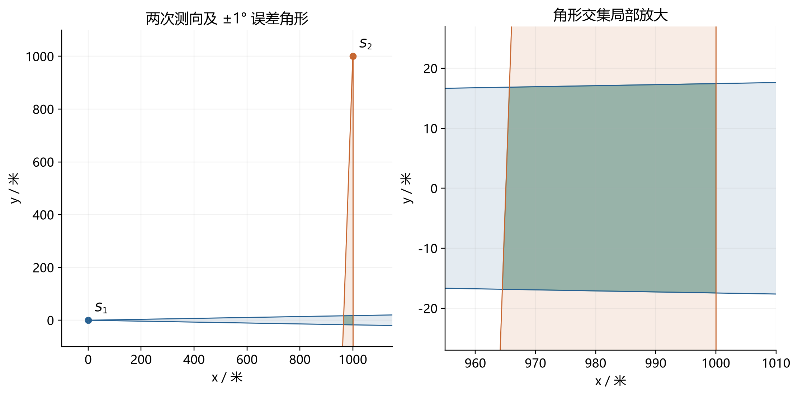
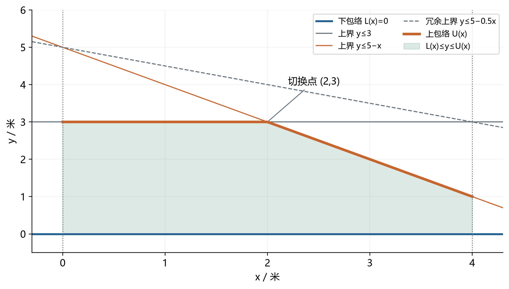
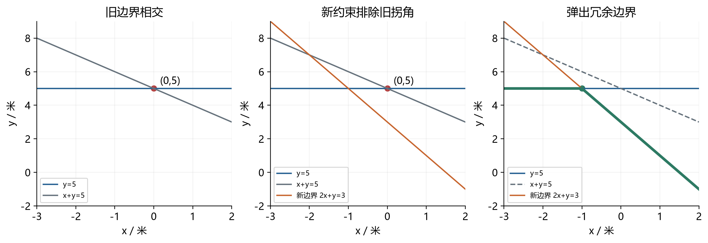
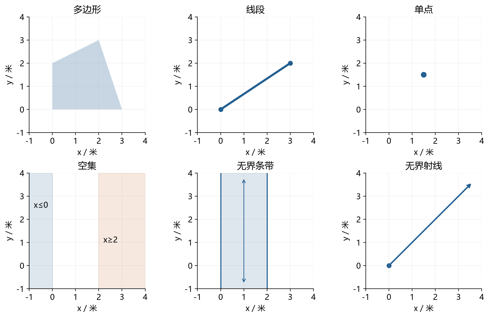
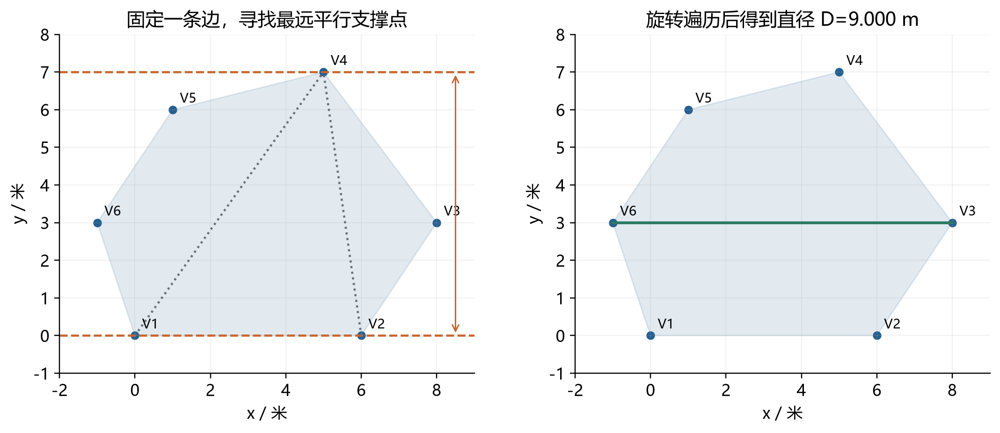
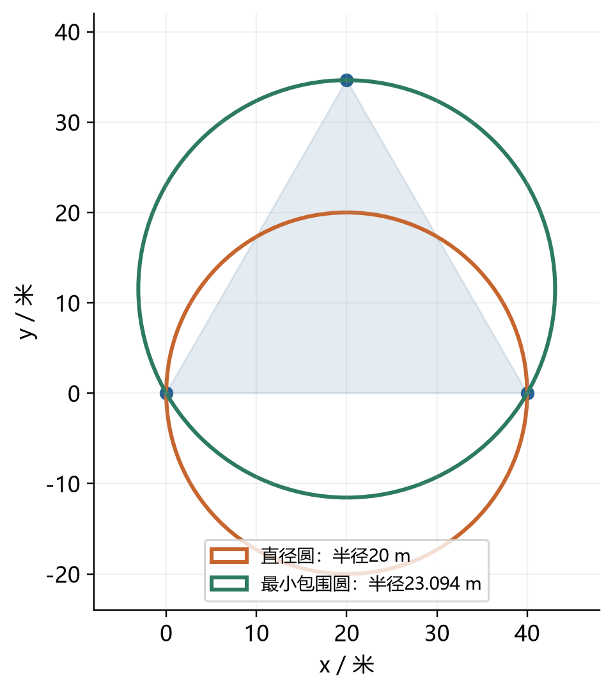

# 第一问：把每条边界理解成地板或天花板

## 1. 我们到底在找什么

一个检测点报告“目标大概在这个方向，误差最多1°”，相当于画出一个很窄的角形。目标要同时符合所有报告，就必须落在所有角形重叠的位置。

每个角形有两条边；一条边要求目标在它的一侧。把所有这些要求叠起来，就是半平面交。题目要求先求这块区域，再找区域里距离最远的两点。

## 2. 第二种方法为什么要排序

如果每加一条边界，都重新和全部旧边界比较，约束多时会很慢。排序的作用是让我们按固定顺序处理边界，并且能确认：某条边界一旦失去作用，以后就不必再找回来。

为了把特殊情况处理清楚，本版把边界分成三类：

- **地板**：要求 $y\ge ax+b$，点必须在它上面。
- **天花板**：要求 $y\le cx+d$，点必须在它下面。
- **左右墙**：要求 $x\ge a$ 或 $x\le b$。

沿x方向走到某个位置，想放下一个点，必须先看看“最高的地板”和“最低的天花板”在哪里。

例子中，地板是 $y=0$，两块主要天花板是 $y=3$ 和 $y=5-x$。

| 所在位置 | 两块天花板高度 | 真正限制点的高度 |
|---|---|---|
| x=1 | 3、4 | 较低的3 |
| x=2 | 3、3 | 都是3，这里交接 |
| x=3 | 3、2 | 较低的2 |

所以真正的上边界会在x=2转弯。程序只需记住“先由哪块天花板负责，到哪里换下一块”，这张有序交接表就是上包络。地板同理，只不过取最高者。

## 3. 队列里存的是什么

队列不是目标坐标的队伍，而是**仍有机会成为真实边界的直线**的队伍。每条直线还记录自己从哪个x开始接管。

为了只写一套逻辑，程序将天花板高度取负号，这样“找最低天花板”也变成“找最高函数”。随后按函数斜率从小到大处理。

斜率较大的函数往右走得更快。如果它将成为最高者，只会从某个位置开始接管。因此新函数只需要从队尾向前检查。

设旧函数是 $y=a_1x+b_1$，新函数是 $y=a_2x+b_2$，且 $a_2>a_1$。令两者高度相等，就能算出接管位置：

$$
s=\frac{b_1-b_2}{a_2-a_1}.
$$

如果新函数在旧函数原计划上岗之前就超过它，旧函数将没有任何值班时间，可以从队尾删除。删掉后继续检查前一条，直到接管时间重新变得有序。

## 4. 一个确实会弹出队尾的例子

三块天花板按负高度函数斜率0、1、2的顺序加入：

1. $y\le5$。
2. $x+y\le5$，即 $y\le5-x$。
3. $2x+y\le3$，即 $y\le3-2x$。

前两块天花板在(0,5)相遇。第三块加入时，该点不满足新要求：$2\times0+5=5>3$。

前两块对应的负高度函数为-5和x-5，原交接时间是x=0。第三块对应2x-3，它与x-5在x=-2就相等：新函数在第二块原本接管之前就超过第二块，所以第二块永远没有上岗机会。

弹出第二块后，只剩 $y\le5$ 与 $y\le3-2x$，它们在x=-1交接。

这并不是丢掉一个仍然有用的要求。将保留的两个要求相加：

$$
y\le5,\quad 2x+y\le3
\quad\Longrightarrow\quad x+y\le4.
$$

既然保留的要求已经保证 $x+y\le4$，当然也保证原来的 $x+y\le5$。删掉第二块后，可行区域完全相同。

## 5. 为什么这样快

假设有一万条边界，其中某次加入可能连续弹出十条，乍看似乎仍要反复计算。关键在于每条边界一共只会入队一次、出队至多一次。

所有弹出动作累计不超过一万次。排序花 $O(m\log m)$，建队列总共只花 $O(m)$。后面生成凸包仍是 $O(m\log m)$，因此完整默认流程保持 $O(m\log m)$。

旧代码如果在最后又让每个顶点重查全部约束，就可能重新变成二次耗时。本版的最后复核查询包络，不重扫全部约束。

## 6. 如何判断有没有地方能放下目标

左右墙先给出允许的横坐标范围。在每个横坐标x上：

- 地板低于天花板：两者之间的点都能放进去。
- 地板等于天花板：只允许放在这一高度。
- 地板高于天花板：这一列无处可放。

所以只需解 $L(x)\le U(x)$。两张包络的交接表都已经排好，程序用两个指针按顺序扫过这些交接点，每一小段内都是一次不等式。

这里的“一维区间计算”没有改变算法身份：本版是在两张已压缩、有序的包络之间扫描一次；第三种方法是对每条原边界都重新检查全部约束，工作量不同。

## 7. 特殊情况都能直观看出来

| 情形 | 地板、天花板和墙的含义 | 应如何输出 |
|---|---|---|
| x≥1，同时x≤0 | 左墙已经跑到右墙右边 | 空集 |
| y≥1，同时y≤0 | 地板处处高于天花板 | 空集 |
| 只有0≤x≤1 | 有左右墙，但上下能无限走 | 无界条带 |
| y=x | 地板与天花板贴在一起，但左右能无限走 | 无界直线 |
| y=x，且0≤x≤3 | 贴在一起的地板天花板被左右墙截住 | 线段 |
| x≥0、y≥0、x+y≤0 | 仅原点放得下 | 单点 |

“有交点”不代表“有界”：一个无限大的象限也有顶点。“少于三个顶点”不代表“出错”：线段与单点都是合法结果。

## 8. 区域求完以后，为什么只看顶点

最终区域是凸的。想象一根橡皮筋包住它：最外面的拐角就是极点。区域内部点可以由极点混合得到，内部两点距离不会超过最远极点对距离。

因此先得到这些极点，再使用旋转卡壳：拿两把保持平行的直尺从两侧夹住凸多边形，转动它们，按顺序记录接触点对，找出最大距离。

单点直接返回0；线段直接算两端距离。无需把它们硬凑成三角形。

## 9. 为什么求出直径，还要单独检查圆

“区域里任意两点相距不超过D”不等于“能装进半径D/2的圆”。等边三角形最容易看出来：任意两顶点的距离都是40米，但半径20米的圆装不下它。

本题的测向区域也会出现这种情况。把第二次示向度从270°改为269°，就得到包内反例：区域直径约49.363米，但直径圆仍有顶点漏在外面，漏出的距离约0.435米。

圆心不能随便挪来补救：最远点对恰好相距D，半径D/2的圆要同时包住它们，就必须以两者中点为圆心。所以检查这个圆，就已经回答了题目问的“是否存在直径为D的覆盖圆”。

## 10. 和第三种方法怎么选

| 比较点 | 本次排序队列上下包络 | 第三种逐边界区间法 |
|---|---|---|
| 核心操作 | 排序、删冗余、合并两个有序包络 | 每条边界参数化后检查全部约束 |
| 一般时间规模 | $O(m\log m)$ | $O(m^2)$ |
| 完整性 | 本包补齐空、无界、点和线段 | 原改进版已覆盖较多退化情况，仍应按实现核验 |
| 编程难点 | 队列不变量、包络交接和数值判断 | 区间端点、平行时可行性和无界判别 |
| 小规模速度 | 有完整检查的常数开销，要看实测 | 代码直接，小输入可能很接近 |
| 泛化边界 | 一般二维线性半平面 | 一般二维线性半平面 |

本包用第二种方法完成第一问，第三种保留为对照。算法快的是计算部分；题目中读取一次示向度仍固定5秒，减少计算毫秒数不会自动减少实际检测次数。
