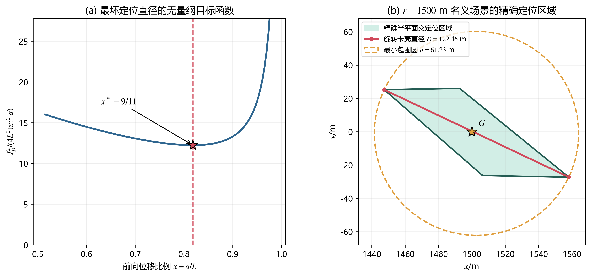
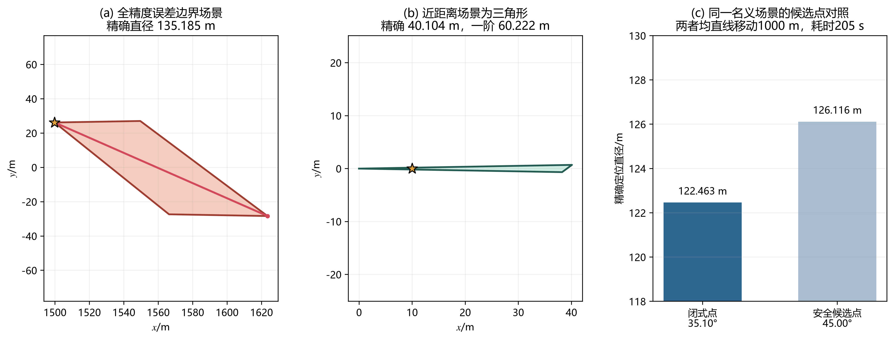
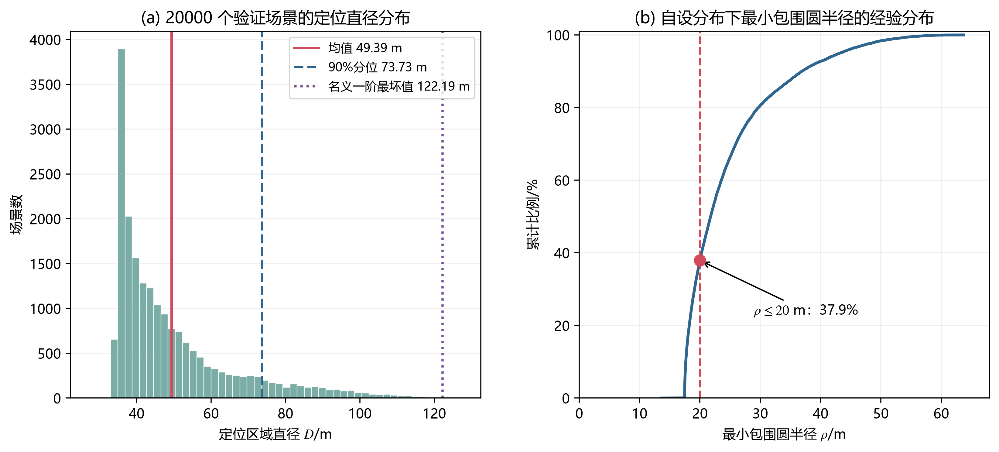

# 5 问题二 第二检测点选择模型

## 5.1 问题分析

机器狗在首次检测点 $S_1$ 获得全向干扰源的示向度后，只能确定干扰源位于读数两侧各 $1^\circ$ 的角形区域内，不能由一次测向确定距离。第二检测点既要保证仍能接收到该源，又要使两次测向形成较好的交会几何。

本文不设置“定位误差与时间”的经验线性权重，而采用分层决策：先把第二次接收安全作为硬约束，再在安全域内最小化定位区域直径，最后单独报告执行时间。由此所得坐标不依赖网格步长、训练样本或人为权衡系数。

需要预先说明，本问给出的最优性结论具有明确范围：它是在解析充分安全域内，对首次示向度中心线上的名义源采用一阶误差带模型，并以最坏径向定位直径为目标得到的闭式最优解；它不是包含任意测角误差组合、后续清除路径和附加障碍约束后的无条件全局最优解。

## 5.2 符号与局部坐标系

设首次检测点为 $S_1=(x_1,y_1)$，首次读数为 $\theta_1$，误差上界为

\[
\alpha=1^\circ.
\tag{1}
\]

建立随首次读数旋转的正交基

\[
\boldsymbol u=(\cos\theta_1,\sin\theta_1)^{\mathsf T},\qquad
\boldsymbol v=(-\sin\theta_1,\cos\theta_1)^{\mathsf T},
\tag{2}
\]

并写成

\[
S_2=S_1+a\boldsymbol u+b\boldsymbol v,\qquad
L=\|S_2-S_1\|_2=\sqrt{a^2+b^2}.
\tag{3}
\]

其中 $a$、$b$ 是同一个位移向量的前向与横向分量，并非两段依次行走的路程。

## 5.3 第二检测点的解析安全域

在局部坐标系中，干扰源可表示为

\[
G=S_1+r(\cos\delta\,\boldsymbol u+\sin\delta\,\boldsymbol v),
\qquad |\delta|\le\alpha.
\tag{4}
\]

只考虑具有实际意义的前向候选 $a\ge0$。同时要求 $b\ne0$；若 $b=0$，两次测向趋于共线，式（11）—（13）的名义定位直径发散，不能形成有效的交会方案。

令 $q=a^2+b^2$，则

\[
\|S_2-G\|_2^2
=r^2+q-2r(a\cos\delta+b\sin\delta).
\tag{5}
\]

由

\[
a\cos\delta+b\sin\delta
\ge a\cos\alpha-|b|\sin\alpha=: \eta
\tag{6}
\]

可得

\[
\|S_2-G\|_2^2\le r^2+q-2r\eta.
\tag{7}
\]

若取

\[
q\le1000^2,\qquad q\le2000\eta,
\tag{8}
\]

则当 $0\le r\le1000$ 时，式（7）右端是关于 $r$ 的凸函数，只需检查两个端点即可知 $\|S_2-G\|\le1000$；当 $r\ge1000$ 时，由 $q\le2000\eta\le2r\eta$ 得 $\|S_2-G\|\le r$。首次接收成功意味着源的实际接收半径至少为 $\max(1000,r)$，故第二点仍能接收到信号。

因此得到解析充分安全域

\[
\boxed{
\mathcal C_{\rm safe}=
\left\{(a,b):
\begin{array}{l}
a^2+b^2\le1000^2,\\
a^2+b^2\le2000(a\cos\alpha-|b|\sin\alpha)
\end{array}
\right\}.}
\tag{9}
\]

它等价于局部坐标中三个半径为 $1000\ \mathrm m$ 的圆盘之交。该安全性来自连续不等式证明，而不是有限次随机试验。

图 1 第二检测点解析安全域及两个对称闭式点

## 5.4 名义一阶定位模型与闭式解

为获得可解析的选点准则，将首次读数中心线置于 $x$ 轴，并先考察名义位置

\[
G=(r,0),\qquad S_2=(a,b),\qquad
d=\sqrt{(r-a)^2+b^2}.
\tag{10}
\]

在 $G$ 邻域内，两次窄角形可一阶近似为两条误差带。其交集为平行四边形，两条半对角线满足

\[
h_1^2=\tan^2\alpha\left[r^2+\frac{(L^2-ar)^2}{b^2}\right],
\tag{11}
\]

\[
h_2^2=\tan^2\alpha\left[r^2+
\frac{(2r^2-3ar+L^2)^2}{b^2}\right].
\tag{12}
\]

于是名义一阶定位直径为

\[
D_{\rm lin}(r;a,b)=2\max(h_1,h_2).
\tag{13}
\]

两式之差为

\[
h_2^2-h_1^2=
\frac{4r(r-a)((r-a)^2+b^2)\tan^2\alpha}{b^2}.
\tag{14}
\]

由单调性可知，$h_1$ 在 $[0,a]$ 上的最大值位于 $r=0$，$h_2$ 在 $[a,1500]$ 上的最大值位于 $r=1500$，且后者不小于前者。因此全部名义径向距离中的最坏点为

\[
r^*=R=1500\ \mathrm m.
\tag{15}
\]

令 $a=Lx$、$|b|=L\sqrt{1-x^2}$，则

\[
\frac{J_D^2}{4\tan^2\alpha}
=R^2+\frac{(A-Bx)^2}{1-x^2},
\quad
A=\frac{2R^2}{L}+L,
\quad B=3R.
\tag{16}
\]

对固定 $L$，右端关于 $x$ 的非恒定部分导数为

\[
\frac{\mathrm d}{\mathrm dx}
\frac{(A-Bx)^2}{1-x^2}
=\frac{2(A-Bx)(Ax-B)}{(1-x^2)^2},
\tag{17}
\]

在放宽后的方向区间 $0<x<1$ 上有 $A-Bx>0$，故唯一极小点为 $x_0(L)=B/A$，并且

\[
\min_{0<x<1}\frac{J_D^2}{4\tan^2\alpha}
=R^2+A^2-B^2
=\left(\frac{2R^2}{L}-L\right)^2
=:g(L).
\]

对 $0<L\le1000<\sqrt2R$，括号内为正且导数 $-2R^2/L^2-1<0$，所以 $g(L)$ 严格递减。任意 $L<1000$ 的安全点均满足目标值不小于 $g(L)>g(1000)$。当 $L=1000$ 时，$x_0=9/11$，且代入式（9）可直接验证其安全可行，因此该点达到下界 $g(1000)$，从而是整个解析安全域内的全局最优点。代入 $R=1500\ \mathrm m$ 得

\[
x^*=\frac{3RL}{2R^2+L^2}=\frac9{11},
\tag{18}
\]

\[
a^*=\frac{9000}{11}=818.1818\ \mathrm m,
\qquad
|b^*|=\frac{2000\sqrt{10}}{11}=574.9596\ \mathrm m.
\tag{19}
\]

该点满足式（9），其名义一阶最坏定位直径为

\[
\boxed{J_D^*=7000\tan1^\circ=122.1855\ \mathrm m.}
\tag{20}
\]

图 2 一阶目标函数与 $r=1500\ \mathrm m$ 名义场景的精确交会区域

## 5.5 第二检测点与执行时间

将式（19）旋转和平移回原坐标系，得到两个对称候选点

\[
\boxed{
S_2=S_1+\frac{9000}{11}\boldsymbol u
\pm\frac{2000\sqrt{10}}{11}\boldsymbol v.}
\tag{21}
\]

执行时应相对首次读数方向偏转

\[
\varphi^*=\arctan\frac{|b^*|}{a^*}
=\arctan\frac{2\sqrt{10}}9
=35.0968^\circ,
\tag{22}
\]

然后沿该方向一次直线移动 $1000\ \mathrm m$。因此，从首次测向结束到取得第二次读数，在频道不变的条件下需要

\[
T_2=\frac{1000}{5}+5=205\ \mathrm s.
\tag{23}
\]

若从首次测向开始计时，应再计入首次测向的 $5\ \mathrm s$；若另有换频道操作，再按题面另加相应时间。目标半径 $1800\ \mathrm m$ 的圆域约束干扰源位置，不约束机器狗必须留在该圆内；障碍物或机器狗活动边界只能作为扩展条件另行加入。

## 5.6 第二次测向后的精确定位

一阶模型只用于推导 $S_2$。得到第二次读数后，主评价仍按问题一的纯角度口径计算

\[
P_{\rm ang}=W_1\cap W_2,
\qquad
D_2=\max_{X,Y\in P_{\rm ang}}\|X-Y\|_2.
\tag{24}
\]

$P_{\rm ang}$ 是凸定位集合，通常为四边形，也可能为三角形、线段或单点。修订后的程序枚举 $m$ 条边界中每对非平行直线的交点，并检查其是否满足全部半平面约束，再构造凸包；复杂度为 $O(m^3)$。对于非退化凸多边形，用旋转卡壳在 $O(k)$ 时间内求直径；对单点和线段直接返回直径。

当两点都返回示向度时，可利用源域和接收半径上界得到保守收缩集合

\[
F_2=\Omega\cap W_1\cap W_2
\cap B(S_1,1500)\cap B(S_2,1500),
\tag{25}
\]

其中 $\Omega$ 约束干扰源而非机器狗。若第二点返回距离不超过 $5\ \mathrm m$ 的 `near`，则不再构造 $W_2$，而应转入直接清除分支。式（25）忽略了示向度还隐含的距离大于 $5\ \mathrm m$ 条件，因此仍是安全的保守超集；其边界含圆弧，若实际计算直径或最小包围圆，需要采用圆弧几何算法或保守多边形逼近，不能直接套用纯多边形旋转卡壳。本文为与问题一结果保持一致，表中直径均采用 $P_{\rm ang}$；两种口径不混用。

## 5.7 确定性检验与离线随机验证

### 5.7.1 四个可复算的确定性结论

| 检验 | 设置 | 精确结果 | 结论 |
|---|---|---:|---|
| 名义最远场景 | $G=(1500,0)$，两次实际误差为 $0$ | $D_2=122.4626$ m | 与一阶值的 $0.2263\%$ 差异只适用于该场景 |
| 全精度误差边界反例 | $G=1500(\cos1^\circ,\sin1^\circ)$，第一次误差 $-1^\circ$，第二次误差 $+1^\circ$ | $D_2=135.1846$ m | 证明 $122.1855$ m 不是全部误差组合的上界，但该反例未被证明是全局最大值 |
| 近距离场景 | $G=(10,0)$，两次实际误差为 $0$ | 三角形，$D_2=40.1043$ m；一阶值 $60.2218$ m | 精确区域不总是四边形，近距离时一阶模型可能偏差较大 |
| 同场景候选点对照 | $G=(1500,0)$，误差为 $0$ | $35.10^\circ$ 点为 $122.4626$ m，$45^\circ$ 点为 $126.1164$ m | 两者均移动 $1000$ m、耗时 $205$ s；只说明闭式点在该名义场景更好 |

边界反例采用未舍入的第二次真实方位 $321.160771571^\circ$ 与读数 $322.160771571^\circ$，避免先把读数截为 $322.16^\circ$ 所产生的数值差异。

图 3 误差边界反例 近距离三角形及同场景候选点对照

### 5.7.2 二万场离线验证

为检查程序稳定性，在自设验证分布下生成 $20000$ 个场景，随机种子为 20260921。接收半径在 $[1000,1500]\ \mathrm m$ 上均匀取值；在首次已收到信号的条件下按面积均匀生成源距离；地点误差由确定性的有界误差场产生。该分布不是题设先验，只用于离线覆盖测试，既不参与选点，也不能替代边界证明。

| 指标 | 均值 | 中位数 | 90% 分位 | 95% 分位 | 99% 分位 | 样本最大值 |
|---|---:|---:|---:|---:|---:|---:|
| 定位直径 $D_2$/m | 49.39 | 43.52 | 73.73 | 86.40 | 104.80 | 127.49 |
| 最小包围圆半径 $\rho$/m | 24.70 | 21.76 | 36.87 | 43.20 | 52.40 | 63.74 |
| 交会锐角/$({}^\circ)$ | 67.41 | 68.18 | 85.56 | 87.76 | 89.54 | 90.00 |

第二点保留信号、获得有效定位集合和真实源包含率在这组样本中均为 $100\%$。修订前后同一批样本的直径最大差为 $4.69\times10^{-13}\ \mathrm m$，最小包围圆半径最大差为 $5.57\times10^{-12}\ \mathrm m$，说明退化支持的程序修订没有改变原有非退化结果。

最小包围圆半径不超过 $20\ \mathrm m$ 的样本比例为 $37.905\%$。该数值仅表示在上述自设随机分布下，两次测向所得集合可被半径 $20\ \mathrm m$ 的圆覆盖的样本比例，不是第三问的实际清除率，也不是题设概率。

图 4 固定闭式点在二万组自设场景下的离线统计

## 5.8 结论与适用范围

第二检测点应选择为式（21）的任一对称点，即相对首次读数方向左偏或右偏 $35.0968^\circ$，沿直线移动 $1000\ \mathrm m$。该点由连续公式推导得到，不含经验权重、网格步长或少量训练样本；从首次测向结束到第二次测向完成需要 $205\ \mathrm s$。

本文严格证明的是第二次接收安全，以及限定模型下闭式点的最优性。$122.1855\ \mathrm m$ 是名义一阶最坏径向直径；$122.4626\ \mathrm m$ 是 $r=1500\ \mathrm m$、零误差名义场景的精确直径；$127.4873\ \mathrm m$ 是二万随机样本最大值；全部允许误差组合下的精确全局最坏值尚未证明，且已知一个合法边界场景达到 $135.1846\ \mathrm m$。四个数值必须分别表述。

第二检测点也不等于清除点。只有对最终可行集求得的最小包围圆半径 $\rho\le20\ \mathrm m$ 时，移至其圆心才可保证一次光学定位覆盖；若 $\rho>20\ \mathrm m$，后续问题仍需追加测向、搜索或覆盖路径。
