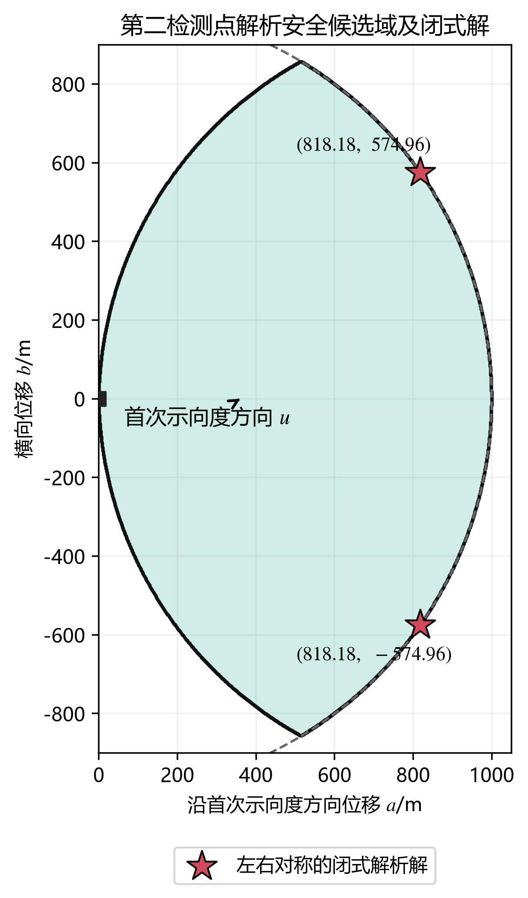
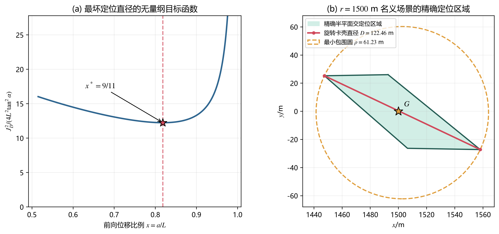
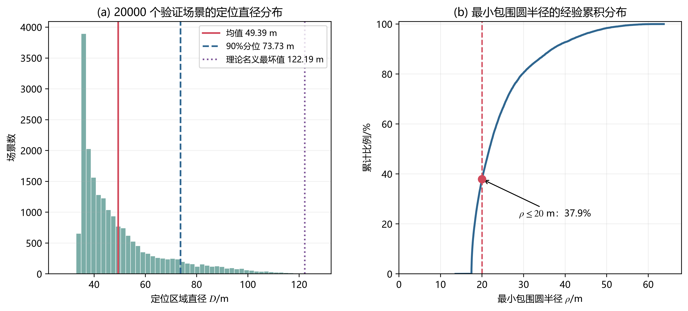

# 5 问题二：第二检测点选择模型

## 5.1 问题分析

机器狗在首次检测点 $S_1$ 测得某全向干扰源的示向度后，只能确定干扰源位于示向度两侧各 $1^\circ$ 的角形区域内，不能由一次测向确定距离。第二检测点既要避免离开该源的有效接收范围，又要使两次测向形成良好的交会几何，从而缩小定位区域。

本问不引入“定位精度—移动时间”的经验权重，而沿用问题一的定位区域直径作为主要评价量。首先根据有效接收半径下界 $1000\ \mathrm m$ 推导具有确定性保证的第二检测点候选域；随后在该候选域中，以所有可能径向距离上的最坏一阶定位直径最小为目标，推导第二检测点的闭式坐标。第二次测向完成后，再使用问题一的半平面交和旋转卡壳算法计算精确定位区域及其直径。

## 5.2 符号与局部坐标系

设首次检测点为 $S_1=(x_1,y_1)$，首次测得的示向度为 $\theta_1$，测角误差上界为

\[
\alpha=1^\circ.
\tag{1}
\]

建立随首次示向度旋转的局部正交基

\[
\boldsymbol u=
\begin{bmatrix}
\cos\theta_1\\
\sin\theta_1
\end{bmatrix},
\qquad
\boldsymbol v=
\begin{bmatrix}
-\sin\theta_1\\
\cos\theta_1
\end{bmatrix},
\tag{2}
\]

其中 $\boldsymbol u$ 指向首次示向度方向，$\boldsymbol v$ 为其逆时针旋转 $90^\circ$ 的横向方向。将第二检测点表示为

\[
S_2=S_1+a\boldsymbol u+b\boldsymbol v,
\tag{3}
\]

其中 $a$ 为前向位移，$b$ 为横向位移，并记

\[
L=\|S_2-S_1\|_2=\sqrt{a^2+b^2}.
\tag{4}
\]

设目标圆域为 $\Omega$，首次示向度对应的角形区域为 $W_1$。由于首次检测已经收到信号，且有效接收半径不超过 $1500\ \mathrm m$，干扰源的首次保守定位区域为

\[
P_1=\Omega\cap W_1\cap B(S_1,1500).
\tag{5}
\]

## 5.3 第二检测点的安全候选域

### 5.3.1 精确鲁棒候选域

对任意假设位置 $G\in P_1$，令 $r=\|G-S_1\|_2$。由于有效接收半径 $R_G\in[1000,1500]$，且首次检测成功意味着 $R_G\ge r$，所以与位置 $G$ 相容的最小接收半径为

\[
R_{\min}(r)=\max(1000,r).
\tag{6}
\]

因此，对所有可能干扰源位置均保证第二次仍能收到信号的精确鲁棒候选域为

\[
\mathcal C_{\mathrm{exact}}=
\left\{
S_2:\ \|S_2-G\|_2\le
\max\!\left(1000,\|G-S_1\|_2\right),
\ \forall G\in P_1
\right\}.
\tag{7}
\]

式（7）定义准确，但直接求解需要在连续区域 $P_1$ 上进行鲁棒优化。为了得到可实时计算且易于证明的策略，下面构造其解析安全子域。

### 5.3.2 解析充分安全域

在局部坐标系中，干扰源真实位置可表示为

\[
G=S_1+r(\cos\delta\,\boldsymbol u+\sin\delta\,\boldsymbol v),
\qquad |\delta|\le\alpha.
\tag{8}
\]

由式（3）和式（8）可得

\[
\|S_2-G\|_2^2
=r^2+a^2+b^2-2r(a\cos\delta+b\sin\delta).
\tag{9}
\]

对任意 $|\delta|\le\alpha$，有

\[
a\cos\delta+b\sin\delta
\ge a\cos\alpha-|b|\sin\alpha.
\tag{10}
\]

记

\[
q=a^2+b^2,
\qquad
\eta=a\cos\alpha-|b|\sin\alpha,
\tag{11}
\]

则

\[
\|S_2-G\|_2^2\le r^2+q-2r\eta.
\tag{12}
\]

取约束

\[
q\le1000^2,
\tag{13}
\]

\[
q\le2000\eta.
\tag{14}
\]

当 $0\le r\le1000$ 时，式（12）右端关于 $r$ 是凸二次函数，区间最大值在端点取得。式（13）保证 $r=0$ 时距离不超过 $1000\ \mathrm m$，式（14）保证 $r=1000$ 时距离也不超过 $1000\ \mathrm m$。当 $r\ge1000$ 时，由 $q\le2000\eta\le2r\eta$ 可得

\[
\|S_2-G\|_2^2\le r^2.
\tag{15}
\]

又因首次检测成功必有 $R_G\ge r$，故到达 $S_2$ 后仍处于有效接收范围内。于是得到解析充分安全候选域

\[
\boxed{
\mathcal C_{\mathrm{safe}}=
\left\{(a,b):
\begin{array}{l}
a^2+b^2\le1000^2,\\[2mm]
a^2+b^2\le2000
(a\cos\alpha-|b|\sin\alpha)
\end{array}
\right\}.}
\tag{16}
\]

式（16）还可写成三个半径均为 $1000\ \mathrm m$ 的圆盘之交：

\[
\begin{aligned}
\mathcal C_{\mathrm{safe}}
={}&B((0,0),1000)\\
&\cap B(1000(\cos\alpha,\sin\alpha),1000)\\
&\cap B(1000(\cos\alpha,-\sin\alpha),1000).
\end{aligned}
\tag{17}
\]

因此，式（16）直接给出了第二检测点的候选区域。该区域是式（7）的一个充分安全子域，安全性来自不等式证明，而不是有限次仿真的经验结论。

**图 1　第二检测点解析安全候选域及闭式解**

## 5.4 基于最坏定位直径的闭式优化模型

### 5.4.1 测向角形的一阶误差带

为了与问题一的评价口径一致，以两次测向后定位区域的直径为目标。将 $S_1$ 平移到原点，并将首次示向度中心线旋转到 $x$ 轴。先考虑名义位置

\[
G=(r,0),\qquad
S_2=(a,b),\qquad
d=\sqrt{(r-a)^2+b^2}.
\tag{18}
\]

在干扰源位置邻域内，半角为 $\alpha$ 的两个测向角形可一阶近似为两条误差带。令 $\boldsymbol z$ 为相对 $G$ 的小位移，取两条中心线的单位法向量

\[
\boldsymbol n_1=(0,1),
\qquad
\boldsymbol n_2=\frac{1}{d}(b,r-a),
\tag{19}
\]

则两条误差带分别为

\[
|\boldsymbol n_1^{\mathsf T}\boldsymbol z|
\le r\tan\alpha,
\qquad
|\boldsymbol n_2^{\mathsf T}\boldsymbol z|
\le d\tan\alpha.
\tag{20}
\]

两条误差带的交集为平行四边形。联立式（20）的四组等号，可得其两条半对角线长度 $h_1,h_2$：

\[
h_1^2=\tan^2\alpha
\left[
r^2+\frac{(L^2-ar)^2}{b^2}
\right],
\tag{21}
\]

\[
h_2^2=\tan^2\alpha
\left[
r^2+
\frac{(2r^2-3ar+L^2)^2}{b^2}
\right].
\tag{22}
\]

故一阶定位区域直径为

\[
D_{\mathrm{lin}}(r;a,b)=2\max(h_1,h_2).
\tag{23}
\]

### 5.4.2 最坏径向距离的确定

由式（21）和式（22）可得

\[
h_2^2-h_1^2=
\frac{4r(r-a)((r-a)^2+b^2)\tan^2\alpha}{b^2}.
\tag{24}
\]

因此，当 $r\le a$ 时有 $h_1\ge h_2$；当 $r\ge a$ 时有 $h_2\ge h_1$。进一步地，$h_1$ 在区间 $[0,a]$ 上单调递减，其最大值在 $r=0$ 处取得；$h_2$ 在 $[a,1500]$ 上单调递增，其最大值在 $r=1500$ 处取得。又因 $a\le L\le1000$，有

\[
2(1500)^2-3a(1500)\ge0,
\tag{25}
\]

故 $h_2(1500)\ge h_1(0)$。所以全部可能径向距离上的最坏定位直径必在

\[
r^*=1500\ \mathrm m
\tag{26}
\]

处取得。这一结论由单调性推导得到，不需要人为选取距离样本或扫描步长。

### 5.4.3 连续求解第二检测点

令

\[
a=Lx,
\qquad
|b|=L\sqrt{1-x^2},
\qquad 0<x<1.
\tag{27}
\]

将 $r=R=1500$ 代入式（22），目标函数可写为

\[
\frac{J_D^2}{4\tan^2\alpha}
=R^2+
\frac{\left(2R^2/L-3Rx+L\right)^2}{1-x^2},
\tag{28}
\]

其中

\[
J_D(a,b)=\max_{0\le r\le1500}D_{\mathrm{lin}}(r;a,b).
\tag{29}
\]

对于固定 $x$，记

\[
H(L)=\frac{2R^2}{L}-3Rx+L.
\tag{30}
\]

在 $0<L\le1000$ 内，$H(L)>0$，且

\[
H'(L)=1-\frac{2R^2}{L^2}<0.
\tag{31}
\]

因此目标函数随 $L$ 增大而减小。移动半径边界 $L=1000$ 上满足式（16）的方向范围为

\[
x\ge x_0=\cos(60^\circ-\alpha)=\cos59^\circ\approx0.5150.
\tag{32}
\]

对 $x<x_0$ 的方向，其安全上界 $L<1000$；由式（31）知其目标值不会小于把 $L$ 放宽至 $1000$ 时的值，因而不能产生更优解。取 $L=1000$、$R=1500$，去掉正常数后得到一元连续目标函数

\[
f(x)=
\frac{\left(\frac{13}{4}-3x\right)(10-6x)}{1-x^2}.
\tag{33}
\]

其导数为

\[
f'(x)=
-\frac{99x^2-202x+99}{2(1-x^2)^2}.
\tag{34}
\]

由式（34）可知，$f(x)$ 在 $x<9/11$ 上严格递减；又有 $x_0<9/11$，故前述 $x<x_0$ 情形即使把移动上界放宽至 $L=1000$，其目标值仍大于 $f(9/11)$。

驻点方程

\[
99x^2-202x+99=0
\tag{35}
\]

的两个根为

\[
x_1=\frac{9}{11},
\qquad
x_2=\frac{121}{99}>1.
\tag{36}
\]

可行区间内只有一个驻点 $x^*=9/11$，且 $f'(x)$ 在该点两侧由负变正，因此它是唯一极小点。由式（27）得到

\[
a^*=1000\cdot\frac{9}{11}
=\frac{9000}{11}
\approx818.1818\ \mathrm m,
\tag{37}
\]

\[
|b^*|=1000\sqrt{1-\left(\frac9{11}\right)^2}
=\frac{2000\sqrt{10}}{11}
\approx574.9596\ \mathrm m.
\tag{38}
\]

该点满足

\[
(a^*)^2+(b^*)^2=1000^2,
\tag{39}
\]

且

\[
\frac{a^*\cos\alpha-|b^*|\sin\alpha}{1000}
=\frac{9\cos1^\circ-2\sqrt{10}\sin1^\circ}{11}
\approx0.8080>\frac12,
\tag{40}
\]

所以闭式解确实位于式（16）的安全候选域内。又因 $f(x^*)=49/4$，理论名义最坏定位直径为

\[
\boxed{
J_D^*=7000\tan1^\circ
\approx122.1855\ \mathrm m.}
\tag{41}
\]

**图 2　最坏定位直径目标函数及精确半平面交校核**

## 5.5 第二检测点选择策略

将局部闭式解旋转、平移回原坐标系，得到第二检测点

\[
\boxed{
S_2=S_1+\frac{9000}{11}\boldsymbol u
\pm\frac{2000\sqrt{10}}{11}\boldsymbol v.}
\tag{42}
\]

正、负号分别表示首次示向度左侧和右侧，两者在理想旋转对称模型中等价。实际执行时：若某一侧受任务边界或不可通行区域限制，则选择另一侧；若两侧均可行，则选择更贴近机器狗后续巡检方向的一侧。若实现环境另外要求机器狗始终位于半径 $1800\ \mathrm m$ 的目标圆域内，只需在候选域外再增加约束 $S_2\in\Omega$。

由于 $\|S_2-S_1\|=1000\ \mathrm m$，机器狗以 $5\ \mathrm{m/s}$ 移动到第二点需要 $200\ \mathrm s$，到点后的第二次测向需要 $5\ \mathrm s$。在频道保持不变的情况下，从首次测向结束到取得第二次示向度共需

\[
T_2=\frac{1000}{5}+5=205\ \mathrm s.
\tag{43}
\]

这里不再设置经验权衡系数：式（42）回答问题二要求的“获得较好定位效果”，式（43）则把该定位方案的执行时间单独列出，供问题三、四的全局路径规划调用。

## 5.6 第二次测向后的精确计算

一阶误差带只用于推导闭式选点坐标。实际到达 $S_2$ 并取得示向度 $\theta_2$ 后，仍按问题一的精确角形模型计算定位结果。设两次测向角形分别为 $W_1,W_2$，则交会定位多边形为

\[
P_2=W_1\cap W_2.
\tag{44}
\]

若需要利用半径 $1800\ \mathrm m$ 的目标圆域进一步截断，可在结果上再取 $P_2\cap\Omega$；这一附加信息只会缩小可行域。程序按题目交会定位图的多边形口径，将每个角形写成两个有向半平面，用半平面交求出凸多边形顶点，再用旋转卡壳求定位直径

\[
D_2=\max_{X,Y\in P_2}\|X-Y\|_2.
\tag{45}
\]

为检验与问题一结论的一致性，程序还枚举两点圆和三点外接圆，计算定位多边形的最小包围圆半径

\[
\rho(P_2)=\min_C\max_{X\in P_2}\|X-C\|_2.
\tag{46}
\]

在名义最远场景 $G=(1500,0)$ 中，对式（42）给出的点进行精确半平面交和旋转卡壳计算，得到

\[
D_{\mathrm{HPI}}=122.4626\ \mathrm m.
\tag{47}
\]

其与式（41）的一阶理论值之间的相对线性化误差为 $0.2263\%$，说明在 $1^\circ$ 的小角度误差下，闭式近似能够准确描述名义最坏径向场景。

## 5.7 蒙特卡洛仿真验证

### 5.7.1 仿真目的与设置

仿真只检验式（42）给出的固定点，不用仿真重新选点。利用平移和旋转不变性，令 $S_1=(0,0)$，首次测得示向度为 $0^\circ$，并固定选择 $b>0$ 的对称支路。共生成 $N=20000$ 个独立场景，随机种子为 20260921，具体设置如下：

1. 有效接收半径 $R_G$ 在 $[1000,1500]\ \mathrm m$ 上均匀生成；
2. 在首次已经取得示向度的条件下，距离 $r\in(5,R_G]$ 按圆盘面积均匀生成，即 $r^2$ 均匀；
3. 每个场景生成一个取值范围为 $[-1^\circ,1^\circ]$ 的地点误差场，使同一地点重复测量误差不变，而不同地点误差随场景变化；
4. 在 $S_2$ 处确认信号后，根据含误差示向度建立四个精确半平面；
5. 用半平面交、旋转卡壳和最小包围圆分别计算 $P_2,D_2,\rho(P_2)$，并逐约束检查真实位置是否包含于 $P_2$。

上述概率分布仅用于覆盖不同距离、接收半径与地点误差的验证场景；题目并未给出这些变量的先验分布，因此仿真均值和分位数不参与式（42）的理论求解。

### 5.7.2 仿真结果

20 000 个验证场景的定位结果如下表所示。

| 指标 | 均值 | 中位数 | 90% 分位 | 95% 分位 | 99% 分位 | 样本最大值 |
|---|---:|---:|---:|---:|---:|---:|
| 定位区域直径 $D_2$/m | 49.39 | 43.52 | 73.73 | 86.40 | 104.80 | 127.49 |
| 最小包围圆半径 $\rho$/m | 24.70 | 21.76 | 36.87 | 43.20 | 52.40 | 63.74 |
| 交会锐角/$({}^\circ)$ | 67.41 | 68.18 | 85.56 | 87.76 | 89.54 | 90.00 |

定位直径均值的 $95\%$ 置信区间为

\[
[49.1658,\ 49.6216]\ \mathrm m.
\tag{48}
\]

算法有效性检查结果为：

| 检查项目 | 结果 |
|---|---:|
| 第二检测点信号保留 | 20 000/20 000（100%） |
| 获得有效有界定位多边形 | 20 000/20 000（100%） |
| 真实干扰源位于定位区域内 | 20 000/20 000（100%） |
| 以旋转卡壳最远点对为直径的圆覆盖定位区域 | 98.025% |
| 最小包围圆半径不超过 20 m | 37.905% |

样本中未出现第二点信号丢失，与式（16）的解析安全性结论一致；但“100% 安全”的依据仍是第 5.3 节的不等式证明，而不是有限样本本身。样本最大直径 $127.49\ \mathrm m$ 略高于式（41）的 $122.19\ \mathrm m$，原因是式（41）描述首次中心线上的一阶名义几何，而仿真使用了非零地点误差和精确角形交。最远点对直径圆在部分场景中不能覆盖整个定位区域，也再次说明问题三、四若使用 $20\ \mathrm m$ 光学覆盖判据，应采用式（46）的最小包围圆，而不能直接用 $D_2/2$ 代替。

**图 3　固定闭式第二检测点的 20 000 组仿真验证结果**

## 5.8 本问结论与模型适用范围

本文给出的第二检测点候选区域为式（16），其能够在有效接收半径未知但与首次检测结果相容的全部情形下保证第二次接收安全。在此解析充分安全域内，采用 $\pm1^\circ$ 测向角形在真实位置邻域的一阶误差带近似，并以所有可能径向距离上的最坏定位直径为目标，得到闭式解析解

\[
\boxed{
S_2=S_1+\frac{9000}{11}\boldsymbol u
\pm\frac{2000\sqrt{10}}{11}\boldsymbol v
}.
\]

即沿首次示向度方向前进 $818.18\ \mathrm m$，再向任一侧横移 $574.96\ \mathrm m$，总移动距离为 $1000\ \mathrm m$。该坐标来自连续函数求导，不含网格步长或经验参数。到达第二点后的实际定位区域仍应由精确半平面交计算。

需要强调的是，式（42）是“解析充分安全域＋一阶误差带＋名义最坏径向直径”模型下的闭式最优解；其优点是可证明、无需先验概率且能实时执行。它不应被表述为包含任意地点误差组合、目标圆域截断和后续清除路径在内的原始非线性问题的无条件全局最优解。
