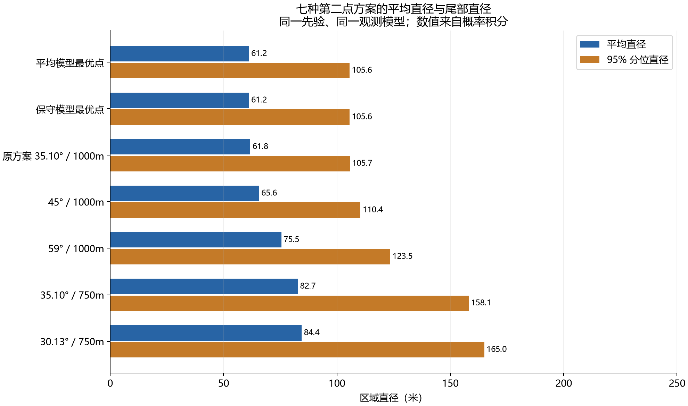
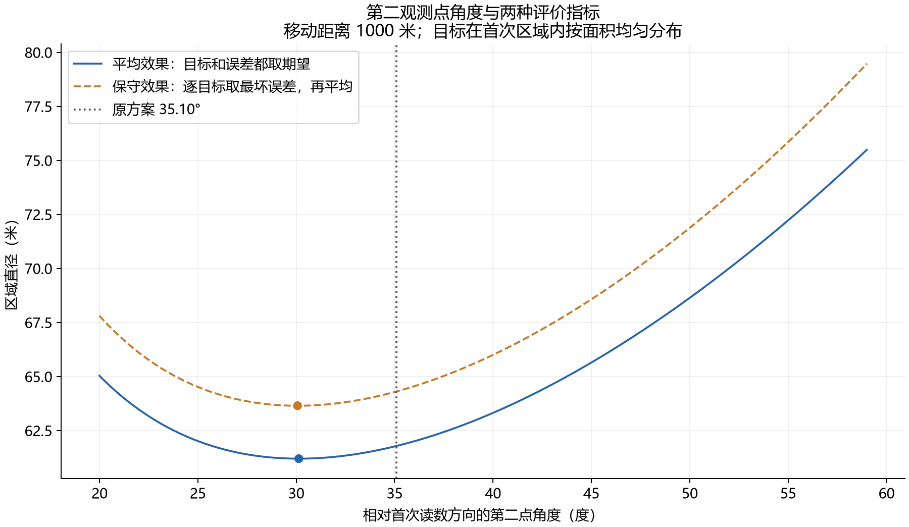
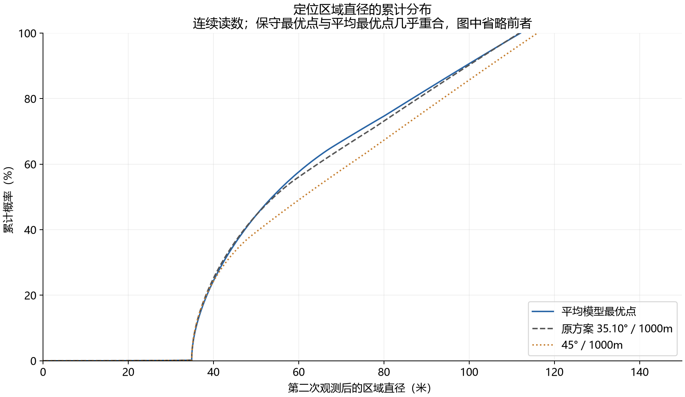

# 第二问：精确区域下的平均与保守第二点优化

日期：2026-09-12。计算范围：暂不加入 1800 米全局边界；使用已确认的面积均匀先验、均匀方向误差和指定的第二点安全域。原有各版代码未被替换。

## 结论

在本次数值搜索中，平均模型选出移动 **1000 米、偏转约 30.13°**；保守模型选出移动 **1000 米、偏转约 30.07°**。二者都在指定安全域内，关于首次方向轴的镜像点具有相同效果。

平均模型点约为 **(864.88, 501.98) 米**，保守模型点约为 **(865.45, 501.00) 米**。坐标原点是第一次观测位置，正 x 轴是第一次读数方向。实际部署应先按实际首次方向旋转这些坐标。

两点相距约 1.14 米，交叉评价的差异仅约万分之一米，没有实用上明显的优劣。若优先满足用户指定的期望直径目标，采用平均模型点即可。工程取角约 30.1°、距离 1000 米也足以表达这个结论。

相较原来的 35.10° / 1000 米点，平均直径减少约 **0.587 米（0.95%）**，保守平均直径减少约 **0.661 米（1.03%）**。这是同一新模型下的公平比较；不能与旧脚本不同先验、不同裁剪方式产生的数字直接比较。

这里的“最优”指多阶段数值搜索所得最优点，未提供整个连续安全域上的解析全局最优证明。积分可精确建模，不代表最优坐标一定有简洁闭式表达式或唯一解。

## 1. 究竟对什么取均匀分布

令 α=1°（积分中使用弧度），R=1500 米。第一次观测后：

\[
F_1=\{(r\cos\delta,r\sin\delta):5<r\le1500,\ |\delta|\le\alpha\},\qquad A=|F_1|=\alpha(1500^2-5^2).
\]

目标 G 在 F₁ **按面积均匀**分布。因此角度 δ 均匀，但半径 r 不均匀，其密度为 2r/(1500²−5²)。正确抽样是 r=√[25+U(1500²−25)]，不能直接均匀抽半径。

第二点 p=(a,b) 满足本次指定的充分安全条件：

\[
a^2+b^2\le1000^2,\qquad a^2+b^2\le2000(a\cos\alpha-|b|\sin\alpha).
\]

计算在这个指定域内优化，没有证明它等于考虑全部题目信息后的最大可行域。没有另外给未知接收半径 R 建概率分布；最大半径 1500 米用于构造当前已确认的先验。

固定一个真实目标 g 后，真实方位为 φₚ(g)。第二读数 Y=φₚ(g)+ε，ε 在 [−α,α] 均匀，且给定 g 后服从同一分布。这就是“2° 的观测扇角在 4° 总扫掠范围内转动”的严格含义。**是中心读数在 2° 区间内均匀，不是让中心再在 4° 区间内均匀。**

不同目标混合后，第二读数 Y 通常不均匀。这是积分权重最容易弄错的地方。

## 2. 用真实区域相交，不使用名义目标或条带

方向读数 y 对应的剩余区域是

\[
F_p(y)=F_1\cap W(p,y,\alpha)\setminus B(p,5),\qquad D_p(y)=\sup_{x,z\in F_p(y)}\|x-z\|.
\]

W 是顶点在 p、中心方向 y、半角 α 的真实楔形。保留首次区域的 1500 米圆弧、首次 5 米排除区和第二点 5 米排除区。方向区域的开闭边界差异不改变直径的上确界。

若目标距第二点不超过 5 米，单独处理“近距离”读数，对应 Fnear=F₁∩B(p,5)。它有自己的概率和区域直径，不能把直径记为零。本报告七个比较点均离首次扇形足够远，近距离概率均为零；一般几何实现仍保留该分支。

面积由直线段和真实圆弧的边界积分计算；直径由相交边界的候选极值点计算。没有以名义目标把区域替换成条带。首次圆弧宽度仅 2°，其与候选点的最远距离在弧端点达到；内侧排除圆弧不会提供新的凸包极点。近距离分支另外检查圆弧上的驻点。

## 3. 为什么原本三重积分可以降成一重积分

连续读数的似然在满足误差界时为常数 1/(2α)。因此

\[
f_Y(y)=\frac{|F_p(y)|}{2\alpha A}.
\]

平均目标严格等于

\[
J_{\rm avg}(p)=\frac1{2\alpha A}\int D_p(y)|F_p(y)|\,dy
+\frac{|F_{\rm near}|}{A}\operatorname{diam}(F_{\rm near}).
\]

这不是额外近似，而是交换积分顺序并按第二读数归并。直观上，某个读数能对应的目标面积越大，该读数越容易出现。不能把所有可能第二读数等权平均。

因此，你关于“可以用积分严格建立目标函数”的判断成立。计算难点在于随 y 改变的交集形状和最远点会切换，使被积函数分段变化；采用数值积分和数值优化更方便。

## 4. 保守模型与平均模型的差别

本次约定的保守模型是：固定每个目标，先挑最不利的第二误差，再对目标位置取面积平均：

\[
J_{\rm cons}(p)=E_G\left[\sup_{|\varepsilon|\le\alpha}D_p(\phi_p(G)+\varepsilon)\right].
\]

近距离分支按上节同样加入。它不是对目标位置也取最坏情况，也不是把“所有误差下的平均”取最大，更不是证明每次定位都不超过 63.65 米。

在第二点的极坐标中，真实方位密度为

\[
q_p(\phi)=\frac1A\int_{\{t>5:p+t(\cos\phi,\sin\phi)\in F_1\}}t\,dt.
\]

射线与圆、直线的交点把 t 分成有限个区间，每段贡献 (t上²−t下²)/(2A)。保守模型由此化成

\[
J_{\rm cons}(p)=\int q_p(\phi)\max_{y\in[\phi-\alpha,\phi+\alpha]}D_p(y)\,d\phi+\text{近距离项}.
\]

实现先发现并细化 D(y) 的局部峰值，再在每个误差窗口内比较两个端点和内部峰值。只检查误差 ±1° 端点通常不充分。最终结果使用自适应积分，并以多级角网格验证峰值发现的稳定性。

## 5. 统一比较

“20 米覆盖概率”指第二次观测后的**整个可行区域**能否被一个半径 20 米圆覆盖，即最小包围圆半径 ≤20 米的概率。它不等同于随意选一个估计点后真目标落在 20 米内的概率，也不能一般地把直径 ≤40 米视为充分条件。

| 方案 | 角度 ° | 距离 m | 平均直径 m | 保守平均 m | 普通直径 P95 m | 20 米覆盖概率 |
| --- | --- | --- | --- | --- | --- | --- |
| 平均模型最优点 | 30.1313 | 1000 | 61.198127 | 63.648023 | 105.557 | 24.399% |
| 保守模型最优点 | 30.0661 | 1000 | 61.198240 | 63.647896 | 105.570 | 24.384% |
| 原方案 35.10° / 1000m | 35.0968 | 1000 | 61.785256 | 64.308711 | 105.693 | 25.151% |
| 45° / 1000m | 45.0000 | 1000 | 65.645958 | 68.573325 | 110.376 | 24.226% |
| 59° / 1000m | 59.0000 | 1000 | 75.489541 | 79.474106 | 123.493 | 17.753% |
| 35.10° / 750m | 35.0968 | 750 | 82.734004 | 88.513703 | 158.149 | 27.350% |
| 30.13° / 750m | 30.1313 | 750 | 84.417751 | 90.501038 | 164.966 | 27.550% |

平均最优点的 20 米覆盖概率约 24.40%，原方案约 25.15%。所以按期望直径评价，新点更好；按一次达到 20 米覆盖的概率评价，这两个点的排名相反。750 米点虽然平均直径更差，却也能有更高的该覆盖概率。目标函数的选择会实质影响方案，不能笼统称一个方案全面更好。

## 6. 直径分布、尾部与阈值概率

普通统计同时平均目标与误差；保守统计则是每个目标取最坏误差后所得随机量的分布。两者分位数含义不同。CVaR95 表示最差 5% 情形的平均值。

| 指标（米） | 平均点：普通分布 | 保守点：普通分布 | 原方案：普通分布 | 平均点：逐目标最坏 | 保守点：逐目标最坏 |
| --- | --- | --- | --- | --- | --- |
| 均值 | 61.1981 | 61.1982 | 61.7853 | 63.6480 | 63.6478 |
| 标准差 | 23.5609 | 23.5594 | 23.9813 | 25.4653 | 25.4636 |
| 均方根 | 65.5769 | 65.5764 | 66.2761 | 68.5532 | 68.5525 |
| P1 | 34.9080 | 34.9080 | 34.9069 | 34.9621 | 34.9622 |
| P5 | 35.1564 | 35.1570 | 35.1254 | 35.3280 | 35.3287 |
| P10 | 35.8865 | 35.8883 | 35.7871 | 36.1820 | 36.1840 |
| P25 | 40.2281 | 40.2339 | 39.9430 | 40.8688 | 40.8750 |
| 中位数 | 53.8131 | 53.8191 | 54.2096 | 55.4954 | 55.5015 |
| P75 | 80.4340 | 80.4210 | 82.1367 | 84.9158 | 84.8978 |
| P90 | 99.1681 | 99.1738 | 99.7022 | 105.6638 | 105.6668 |
| P95 | 105.5568 | 105.5700 | 105.6929 | 112.0521 | 112.0701 |
| P99 | 110.7443 | 110.7605 | 110.5516 | 112.0521 | 112.0701 |
| P99.9 | 111.9228 | 111.9406 | 111.6522 | 112.0521 | 112.0701 |
| CVaR90 | 105.5745 | 105.5864 | 105.7077 | 110.5539 | 110.5676 |
| CVaR95 | 108.7945 | 108.8097 | 108.7252 | 112.0521 | 112.0701 |
| CVaR99 | 111.3978 | 111.4156 | 111.1627 | 112.0521 | 112.0701 |

保守分布的表格来自密集角网格，均值最后约 0.0001 米可受滑动最大值网格影响；主比较表使用更精细的峰值搜索和自适应积分。不要把显示的小数位全部理解为经过证明的精度。平均点的最大可能直径数值约 112.053 米；平均 61.198 米不提供逐次保证。

| 阈值 | 平均点 | 保守点 | 原方案 |
| --- | --- | --- | --- |
| D ≤ 10 米 | 0.0041% | 0.0041% | 0.0040% |
| D ≤ 20 米 | 0.0322% | 0.0323% | 0.0306% |
| D ≤ 30 米 | 0.1085% | 0.1085% | 0.1027% |
| D ≤ 40 米 | 24.3994% | 24.3841% | 25.1512% |
| D ≤ 50 米 | 44.4095% | 44.3965% | 44.4179% |
| D ≤ 60 米 | 57.6165% | 57.6188% | 56.0887% |
| D ≤ 80 米 | 74.6594% | 74.6734% | 73.1498% |
| D ≤ 100 米 | 90.6550% | 90.6492% | 90.2515% |
| D ≤ 120 米 | 100.0000% | 100.0000% | 100.0000% |

## 7. 面积与最小包围圆

| 方案 | 平均区域面积 m² | 区域面积 P95 m² | 平均包围圆半径 m | 半径 P95 m |
| --- | --- | --- | --- | --- |
| 平均模型最优点 | 940.912 | 1982.630 | 30.5991 | 52.7784 |
| 保守模型最优点 | 939.725 | 1980.844 | 30.5992 | 52.7850 |
| 原方案 35.10° / 1000m | 1037.487 | 2133.608 | 30.8927 | 52.8465 |
| 45° / 1000m | 1258.599 | 2503.573 | 32.8231 | 55.1880 |
| 59° / 1000m | 1623.461 | 3141.249 | 37.7449 | 61.7467 |
| 35.10° / 750m | 1392.491 | 3261.341 | 41.3670 | 79.0744 |
| 30.13° / 750m | 1346.441 | 3263.094 | 42.2089 | 82.4830 |

最小包围圆通过候选边界点的两点支撑圆、三点支撑圆检查得到，并另用独立几何库核验；不是简单用直径除以二替代。每个方案完整的分位数、阈值概率、面积和半径统计均在 policy_statistics.json。

## 8. 独立模拟与数值验证

20 万组目标与误差样本使用固定种子 2026091201，目标按面积均匀生成。各方案使用同一批目标和同一标准化误差进行成对比较以降低比较噪声；这不表示现实中不同位置误差必然相同。

| 方案 | 模拟平均直径 m | 均值标准误 m | 相对平均最优点差值 m | 差值标准误 m | 模拟 20 米覆盖概率 |
| --- | --- | --- | --- | --- | --- |
| 平均模型最优点 | 61.24602 | 0.05278 | 0.000000 | 0.000000 | 24.445% |
| 保守模型最优点 | 61.24611 | 0.05278 | 0.000083 | 0.000086 | 24.421% |
| 原方案 35.10° / 1000m | 61.83540 | 0.05371 | 0.589382 | 0.006037 | 25.152% |
| 45° / 1000m | 65.70227 | 0.05803 | 4.456247 | 0.016521 | 24.141% |
| 59° / 1000m | 75.55750 | 0.06658 | 14.311477 | 0.029952 | 17.670% |
| 35.10° / 750m | 82.82042 | 0.10121 | 21.574403 | 0.056406 | 27.276% |
| 30.13° / 750m | 84.50206 | 0.10672 | 23.256034 | 0.060742 | 27.485% |

独立模拟的均值标准误约 0.05 米，不能用它分辨两种最优点约 0.0001 米的微小差异；主结果使用确定性积分。所有连续读数样本均包含真目标。

验证记录包括：

- 360 组独立几何对照，包含扇形内部观测点、近距离分支和误差端点。相对高密度多边形参考，最大直径差约 1.47×10⁻⁶ 米，最小包围圆半径差约 7.35×10⁻⁷ 米。参考本身有圆弧离散误差，这些数值不是全域误差定理。
- 两个目标的全域差分进化搜索、1000 米边界细化及多级积分；额外扫描 3240 个安全域点，并检查小距离、原点和 950/990/995/999/1000 米径向剖面。
- 2049、8193、32769、131073 节点积分收敛；保守模型峰值发现网格 1025、4097、16385 的自适应结果稳定。
- 两个最优点的读数概率和真实方位概率积分均接近 1。具体误差估计与收敛值保存在 JSON 文件中。

搜索和校验支持“1000 米、约 30.1°”的结论，但不能替代解析全局最优证明。安全域边界的最优性目前也是数值发现。

## 9. 第二读数保留 0.01° 的影响

先产生真实角加均匀 ±1° 误差，再四舍五入到 0.01°。如果仍以舍入后的读数为中心使用 ±1° 区域，可能排除真目标；可行支持应扩到 ±1.005°。

| 方案 | 仍用 ±1°：遗漏/20万 | 扩大到 ±1.005°：遗漏/20万 | 扩大后模拟平均直径 m |
| --- | --- | --- | --- |
| 平均模型最优点 | 270 | 0 | 61.3515 |
| 保守模型最优点 | 254 | 0 | 61.3516 |
| 原方案 35.10° / 1000m | 260 | 0 | 61.9502 |

舍入后某个输出的概率，应对原连续读数密度在该舍入区间积分。不能直接把扩大后区域面积当作概率：此时似然在支持边缘变化，扩大区域内的后验也不再处处均匀。我们仍按其完整可行支持计算直径，按正确离散输出概率取期望。

| 舍入后的局部再优化 | 角度 ° | 平均直径 m | 保守平均 m |
| --- | --- | --- | --- |
| mean | 30.09384 | 61.303727 | 63.757045 |
| conservative | 29.94175 | 61.304419 | 63.756297 |

舍入再优化在 1000 米边界、连续解附近扫描并细化；它不是整个安全域的舍入模型全局最优证明。5 点和 9 点高斯积分结果已交叉检查。最优方向仍约 30°，对实用结论影响很小。本项只研究第二次读数舍入，首次区域保持已约定的 ±1°。

## 10. 适用范围与下一步

本次只优化“第一次已有读数之后，第二点放在哪里”。1000 米移动按 5 米/秒加一次 5 秒观测，为 205 秒；750 米为 155 秒。这不是整个任务的总耗时，也没有优化第三次及后续观测。

真正用于完整题目仍应补入：1800 米全局边界、第一次观测位置与边界的关系、题目对接收半径和已有信息的完整条件、后续观测策略，以及官方模拟器运行验证。边界会改变首次区域、先验与对称性，当前固定角度不能直接宣称对所有情形通用。

若后续优化目标改为“总任务时间”或“第二次就达到 20 米覆盖的概率”，需要重新定义目标函数；不能沿用本次平均直径最优的结论。

## 文件与复现

- `README_结果与推导.md`：本报告。
- `results/policy_comparison.csv`：七方案宽表，含普通和逐目标最坏的分位数、标准差、尾部均值和阈值概率。
- `results/policy_statistics.json`：完整概率积分统计，另含面积和最小包围圆统计。
- `results/paired_200000_scenes.npz`：20 万组真目标、误差及各方案逐样本直径、包围圆半径。
- `results/paired_monte_carlo.json`：模拟、成对差值、标准误。
- `results/rounding_validation.json`、`results/rounded_reoptimization.json`：舍入检验与局部再优化。
- `results/geometry_validation.json`、`results/quadrature_convergence.json`、`results/search_coverage.json`：核验记录。
- `results/figures/`：三张可导出的对比图；`results/angle_profile.csv`：角度曲线数据。

本交接包使用 Python 3.12 验证，依赖版本见 requirements.txt。环境安装和复现方法见《01_运行与文件说明.md》；统一入口为 run_reproduce.py，复现结果保存到新的子目录，不覆盖随包交付的结果。

旧方案比较基准为 a=9000/11、b=2000√10/11；除这一已知原方案点外，新增基准角度/距离只是用于比较，并非称为旧版本算法。
