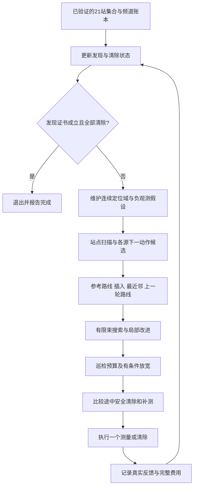

# 算法、冻结参数及代码对应

默认方案标识为 `integrated`，核心类是 `IntegratedPolicy`。本包保留原代码字节，参数冻结后未根据新检验结果再次调参。论文正文参考见文档01，实测统计见文档03。

## 1. 一个动作之后发生什么

测量返回 `direction`、`near` 或 `no_signal`；清除返回成功或未发现目标。`near` 后的清除是下一项真实动作，仍会进入下一轮规划。未完成站点的频道账本持续保留。新检验中18,678项实际动作对应18,678次全局规划。

## 2. 冻结参数

| 参数 | 默认值 | 作用和限制 |
|---|---:|---|
| 目标先验域、测量接收上界圆 | 1024边外切多边形 | 完整误差界的保守几何 |
| 测角半角 | 1.005° | ±1°及0.01°读数舍入余量 |
| 测量接收距离上界 | 1500米 | 只用收到信号可知的上界 |
| 巡检站 | 原点＋999米圆8点＋1864米圆12点 | 共21站，方向覆盖证书已通过 |
| 证书核验域 | 128边外切先验域 | 比1024边域更大，保留旧证书有效性 |
| 证书距离筛选 | ≤999.9米 | 小于最小有效半径1000米 |
| 证书单元凸包内侧裕量 | ≥0.00001米 | 浮点数值充分条件核验 |
| 证书分割深度上限 | 30 | 超限不会返回“已证明” |
| 安全覆盖半径 | 19.8米 | 预留0.2米裕量 |
| 默认束搜索 | 深度3、宽度4、分支6 | 每轮一次有限束搜索 |
| 扩大束搜索 | 深度5、宽度12、分支8 | 实验选项，非默认 |
| 默认局部改进 | 2轮×4种操作×每种10次候选 | 只接受预测成本下降 |
| 扩大局部改进 | 4轮×4种操作×每种20次候选 | 开发组未改善普通均值 |
| 发现延迟权重 | 0.08 | 预测总费用之外的延迟惩罚 |
| 初始巡检余量 | 500米 | 累计站点序列预算，不逐轮重置 |
| 超限净收益门槛 | 20秒 | 已扣最后发现风险，且服务收益必须为正 |
| 正测角最小间隔 | 50米 | 近点新读数不增加测角约束；不代表独立 |
| 同源负观测重复点筛选 | 30米 | 减少重复无信号探测 |
| 途中候选 | 当前点、25%、50%、75%、投影点 | 路段长度至少160米才增加内部候选 |
| 每场可选补测上限 | 40次 | 包括当前位置、途中、已知频道站点补测 |
| 补测半径收益换算 | 0.35秒/米 | 经验代价模型，非真实物理定律 |
| 接纳机会补测 | 预计收益 > max(12秒, 实际增量开销＋4秒) | 同时计入换频与绕行 |
| 增量收益位置假设 | 最多5个 | 完整区域不因抽样而缩减 |
| 低收益暂停 | 连续3次补测未明显改善 | 半径缩小至少15%等视为显著改善 |
| 一般局部服务动作 | 每源最多8次后进入连续覆盖候选 | 边界补救单独记账 |
| 早期一般服务 | 每源4次后可推迟到未知巡检完成 | 边界补救候选有独立处理 |
| 边界外侧交会偏移 | 外法向60米，切向±90米 | 每源最多一轮、2测量＋3不确定清除 |
| 全场动作安全上限 | 6000 | 工程退出条件，不等于任意场景成功证明 |

边界补救还有观测门槛：至少3个内部站完成、内部站检测到的不同频道不超过2个、目标有外侧正观测、目标域与圆周相交。若全局已有至少2次补救失败且没有成功，暂停新的补救过程。中心试清除只在预测半径不大于80米时提出，重复失败点也被过滤。

## 3. 几何计算到底是哪一种

最终实现是**有序凸多边形逐条半平面裁剪**。测向保留真实角度夹角；每个距离圆拆成1024条切线半平面。每条约束依次裁剪当前多边形，裁剪完再求包围圆。它不是“固定宽度条带”模型，也不是所有圆弧边界的精确交集求解。

第一问的三版本表讨论的是另一组一般半平面求交实现。第四问这里的主更新过程不等于其中“任意两条边界枚举交点＋凸包”或“逐边界可行参数区间＋凸包”。方法之间都可以表示同一类直线约束，但具体计算流程不能混写。

边界补救函数会计算多边形与1800米圆周相容的弧段，用其代表点提出试清除。该弧段是行动候选依据，目标区域仍按完整凸多边形维护。

## 4. 哪些步骤有保证，哪些是预测

| 项目 | 可以说的结论 | 不能据此声称 |
|---|---|---|
| 测角＋外切圆裁剪 | 满足误差及接收模型时保留真实源 | 区域就是精确圆弧交集 |
| 21站连续覆盖 | 每个位置、每个半平面方向至少有一个可接收站 | 站数最少、路线全局最短 |
| 包围圆安全清除 | 满足半径及点位条件时覆盖整个可行域 | 区域直径≤40即可安全清除 |
| 矩形网格覆盖 | 有限清除圆覆盖整个连续区域 | 任意场景在6000动作内成功 |
| 假设掩码、位置样本 | 比较概率、收益和代价 | 空样本证明源不存在 |
| 束搜索与局部搜索 | 在有限候选中找较低预测成本 | 求得全局最优反馈策略 |
| 巡检条件放宽 | 对预测收益与最后发现风险作保护 | 所有放宽均真实提速 |
| 新检验0/69兜底 | 本批69场未执行最后光学覆盖 | 算法永远不需要兜底 |

## 5. 主要代码定位

下表中的路径均相对本包的 `code/integrated_q4_20260913/`。

| 文件／函数 | 用途 |
|---|---|
| `integrated_strategy.py: IntegratedPolicy` | 最终策略、候选动作、预算放宽、边界过程 |
| `IntegratedPolicy.plan / _search` | 具体动作位置计价，多起点及局部改进 |
| `IntegratedModel.details / cost` | 完整预计服务费用与延迟目标 |
| `IntegratedModel.last_discovery_charge` | 条件总数16下的最后发现正延迟 |
| `incremental_gain / opportunistic` | 当前点、途中位置的增量补测收益 |
| `boundary_action / execute` | 边界步骤建议与实际状态推进 |
| `action_strategy.py: execute / refresh_certificate / run` | 每次只执行一项请求、站点账本和终止 |
| `reliable_action_strategy.py` | 低收益补测暂停、样本耗尽与覆盖启用处理 |
| `refined_geometry.py` | 1024边圆、逐半平面裁剪、连续方向覆盖核验 |
| `geometry.py` | 几何基本操作及包围圆 |
| `optimized_geometry.py: polygon_optical_cover` | 连续域的有限光学覆盖 |
| `bayesian_belief.py` | 未知频道的有限半径、方向、位置假设 |
| `predictive_models_q4.py` | 已知目标清除、补测与恢复代价预测 |
| `common_simulator.py` | 统一四波空间相关误差模型 |
| `simulator.py` | 自建物理场景、协议反馈及时间计费 |
| `experiment.py` | 同场景跨版本实验、真值与时间账审计 |

`experiment.py` 为审计器持有真值，以检查包含性和清除完成；策略本身不读取真值、场景类型或误差尺度。最终离线入口是本包根目录 `run_demo.py`，统一对照入口是 `rerun_benchmarks.py`。

## 6. 本轮没有解决的问题

普通平均仍为440.65秒/源。一个16源案例由10站增至19站，即使没有触发预算放宽也损失了提前结束巡检的机会；另一个最大退步案例新增668.46秒，其中656.46秒来自走路。后续可针对上限以内的发现顺序、服务结束点及失败回访预测研究，但这些后续设想尚未修改进本次冻结代码。
