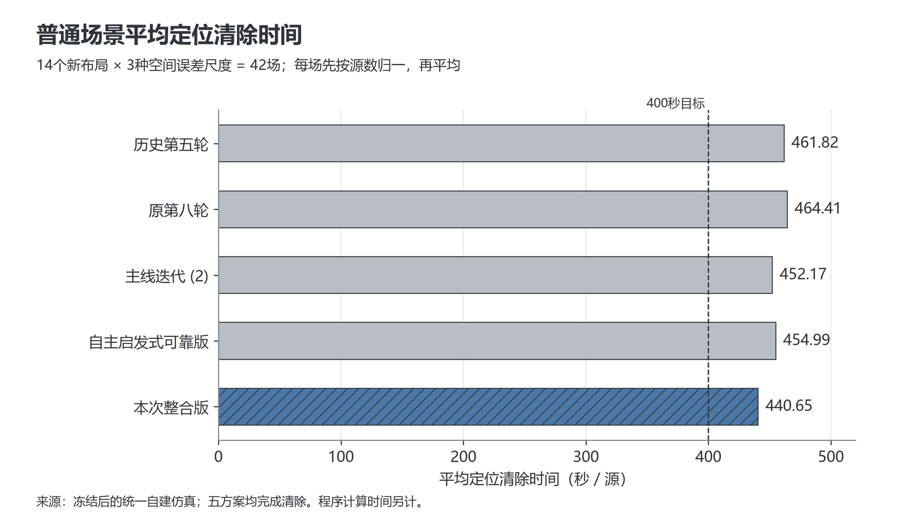
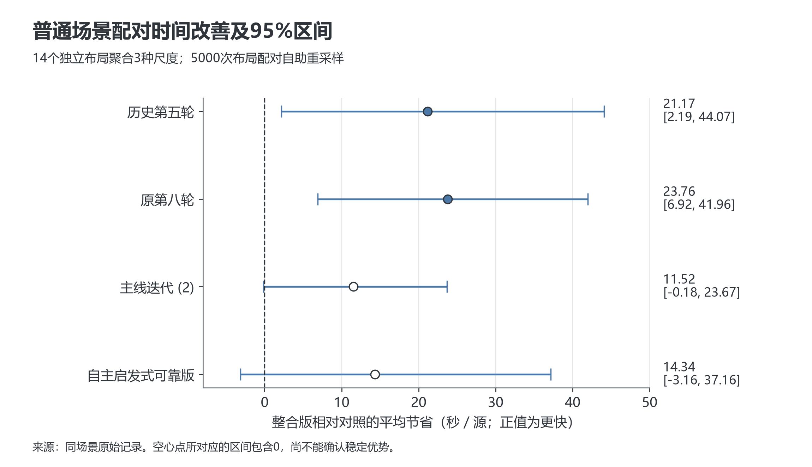
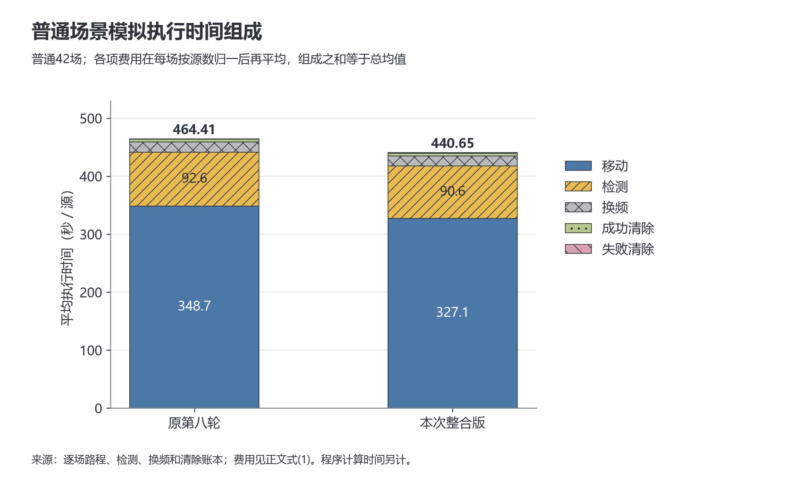

# 图表、图注与数据字典

图片均由归档数据重新计算生成，无新增仿真。PNG可用于Word，SVG适合放大和矢量排版。图的分母、单位和样本数保留在图内；论文可将说明移入图注，但不能省略统计口径。

## 图1：普通场景平均定位清除时间

建议图注：统一自建空间相关误差场下，五种方案在普通14个新布局、每布局3种尺度共42场上的平均定位清除时间。每场先计算总模拟时间除以源数，再对场次取平均。虚线表示400秒/源目标。整合版均值440.65秒/源，尚未达到该目标。

数据：`tables/ordinary_distribution.csv`。此图表达绝对均值，不表达稳定优越性；应结合图2。

## 图2：普通场景配对时间改善与不确定性

建议图注：整合版相对四个对照的平均时间节省及按布局配对自助法95%区间。正值表示整合版更快。按14个布局聚合其3种尺度的配对差值，作5000次重采样；重复尺度未视为独立布局。相对主线迭代 (2) 和自主启发式版的区间包含0。

数据：`tables/paired_improvement.csv`。这里的区间对应“平均节省”，不能误标成每个算法均值的置信区间。

## 图3：普通场景费用组成

建议图注：原第八轮与整合版在普通42场中的平均每源模拟时间分解。各场先分别以源数归一移动、检测、换频、成功清除和失败清除费用，再对场次取平均，因此组成之和等于该方案的平均时间。程序计算时间未计入这张图。

数据：`tables/paid_time_components.csv`。主要节省来自走路时间；这张图不单独识别某一改动的因果贡献。

## 论文表格索引

| 表文件 | 含义 |
|---|---|
| `tables/mean_by_scene.csv` | 5方案×5场景组均值、分布、路程、检测与兜底 |
| `tables/ordinary_distribution.csv` | 普通组每版42场的分布与执行指标 |
| `tables/paired_improvement.csv` | 普通组4组配对节省、布局自助区间与胜负场次 |
| `tables/development_ablation.csv` | 开发普通14场的扩大搜索、取消保护、关闭补测消融 |
| `tables/paid_time_components.csv` | 各类费用按源归一后再平均的分解 |
| `tables/stations.csv` | 初始路线次序下21站坐标，后续会重新规划 |
| `code/integrated_q4_20260913/results/heldout/comparison.csv` | 全部345场逐场对照 |

## 逐场主要字段

| 字段 | 单位／定义 |
|---|---|
| `variant` | `fifth`第五轮，`eighth`第八轮，`boundary`主线迭代 (2) 边界补救，`reliable`自主启发式可靠版，`integrated`最终整合版 |
| `seed` | 自建场景种子，不是官方案例编码 |
| `mode` | `mixed`普通；`edge_outward`边界朝外；`rotated_cluster`旋转聚集；`minimum_range`最小半径；`edge_inset`边界内侧朝外 |
| `length_scale_m` | 合成误差场尺度，100／300／900米 |
| `source_count` | 本场真实源数，只由审计评价使用 |
| `completed`、`clear_ratio` | 算法报告完成及实际清除比例 |
| `virtual_time_s` | 整场模拟执行时间，秒 |
| `time_per_source_s` | 本场模拟时间／成功清除数；本批全清除，等于T/N |
| `distance_m` | 包含定位、巡检和清除绕行的总移动距离，米 |
| `measures`、`switches` | 测量次数与检测频道变化次数 |
| `clear_failures` | 光学试清除失败次数，每次3秒 |
| `fallback_attempts` | 最后连续覆盖清除尝试次数，不等于所有失败清除 |
| `stations_visited` | 完成所需频道扫描的站点数量 |
| `runtime_s` | 本机测得的整场策略运行时间，秒，不是官方正式测试程序时间 |
| `last_first_discovery_s` | 最后一个源首次被发现时的模拟时刻 |
| `containment_violations` | 审计发现真实源不在维护多边形内的次数 |
| `nearby_effective_bearings` | 审计识别小于30米的有效测角对；策略实际采用更严格50米门槛 |

原始JSONL还包含各动作类别计费、巡检放宽明细、边界补救计数、动作与重规划数、完整清除频道及发现证书种类。统计脚本不丢弃退步场次。

## 图件制作与核对说明

三图分别回答绝对均值、配对不确定性、费用组成三个问题。第一图使用蓝色突出整合版、灰色表示历史对照，并保留直接标签；第二图用点和区间及零线；第三图用明确标注与纹理区分费用，黑白打印仍能区分。坐标单位、样本规模及原始数据路径均可追溯。图1从零开始，图2是带零线的差值坐标。

图件为本队论文用途，未添加第三方标志。可引用整合版在本批表现，不能将图件解读为整个问题的数学最优性证明。
